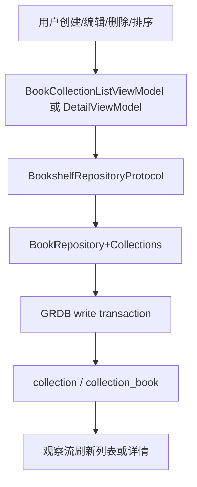
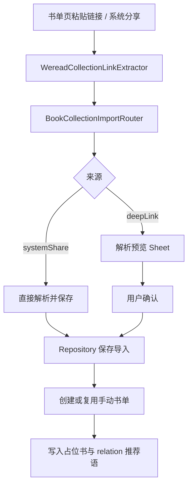

# 书单迁移设计文档

更新日期：2026-06-27

## 设计原则

- 业务意图对齐 Android，平台表达使用 iOS 原生导航、Sheet、Menu、系统分享和可感知反馈。
- 数据库语义优先，UI 只是触发业务意图；所有读写都经 Repository。
- 手动书单和年度书单分清结构权限：手动书单可维护结构，年度书单由读完记录自动同步。
- 书单内 relation 文本保持同一底层字段，通过 UI 上下文映射为 `收藏理由` 或 `年度点评`。
- 微信读书导入采用预览确认，避免网页结构变化时直接写入坏数据。

## 架构拆分

| 层级 | 设计 | 关键类型 |
| --- | --- | --- |
| App/Infra | 系统 URL、Share Extension handoff 与微信读书链接提取。 | `BookCollectionImportRouter`、`BookCollectionShareImportHandoffStore`、`WereadCollectionLinkExtractor` |
| Domain | 书单列表、详情、占位书、导入预览、分享文件与显示偏好模型。 | `BookCollectionListItem`、`BookCollectionBookItem`、`BookCollectionPlaceholderBookDraft`、`BookCollectionImportPreview`、`BookCollectionDisplaySetting` |
| Data | 集中封装 `collection` / `collection_book` 读写、占位书、年度同步、导入解析和分享快照。 | `BookRepository+Collections`、`AnnualCollectionSync`、`CollectionRecord`、`CollectionBookRecord` |
| ViewModel | 编排列表观察、详情观察、写操作反馈、导入、分享和封面搜索状态。 | `BookCollectionListViewModel`、`BookCollectionDetailViewModel`、`BookCollectionCoverSearchViewModel` |
| View | 承载书单列表、详情、业务 Sheet、页面私有视觉组件和系统分享面板。 | `BookContainerView`、`BookCollectionListView`、`BookCollectionDetailView`、`BookCollectionSheets`、`BookCollectionCoverSearchSheet` |

## 入口与列表

`BookContainerView` 负责 `书籍` / `书单` 二级页切换。书单 Tab 的顶部操作由 `BookCollectionTopActionPill` 承载，按当前分组显示创建、导入、排序和显示设置入口。

`BookCollectionListViewModel` 初始化时从 Repository 读取 `BookCollectionDisplaySetting`，恢复列表/网格、封面排列、统计显示和最近选择的书单分组。列表观察流来自 `observeBookCollectionList()`，年度书单进入时触发 `repairAnnualBookCollections()`，修复旧数据里的年度关系。

## 手动书单写入流程

关键规则：

- 创建书单按 Android `CollectionDao.query(title, desc)` 查重，新书单 `order = MIN(order) - 1`。
- 编辑手动书单只更新标题、简介和 `updated_date`。
- 删除手动书单软删除本体和有效 relation。
- 手动书单排序写 `collection.order`；书单内书籍排序写 `collection_book.order`。
- 年度书单不走这些结构写入口。

## 添加书籍与占位书

书单详情继续使用统一 `BookPickerView`，通过配置启用：

- `scope = .both`
- `selectionMode = .multiple`
- `allowsCreationFlow = true`
- `creationAction = .inlineManualEditor`
- `onlineSelectionPolicy = .returnRemoteSelection`

ViewModel 将 picker 返回结果统一转换为 `BookCollectionBookSelectionInput`：

- 本地有效书：写入 relation。
- 在线结果或手动创建结果：生成 `BookCollectionPlaceholderBookDraft`，插入 `book.is_deleted = 1` 的占位书，再写入 relation。

占位书恢复调用 `restoreCollectionPlaceholderBook`，将 `book.is_deleted` 改为 0，放入默认书架尾部，并按 Android `addBookToRead` 意图切到在读状态。原有书单 relation 不删除、不重建。

## 年度书单

年度书单由 `AnnualCollectionSync` 维护：

- 读完年份来自有效 `book_read_status_record` 与 `book` 当前读完快照。
- 不再属于读完年份的 relation 软删除。
- 缺失年份先创建标题为 `"{year} 年阅读书单"` 的年度 collection，再插入 relation。
- 年度详情只允许编辑年度说明和单本年度点评，不允许添加、移出、排序或删除书单。

年度说明写入 `collection.desc`。单本年度点评写入 `collection_book.recommend`，与手动书单收藏理由共享底层字段但文案不同。

## 微信读书导入

应用内导入先进入预览，系统分享导入直接保存但仍复用同一 Repository 解析和保存能力。解析失败、取消或网络失败时不写库。

## 分享图与导出边界

当前 iOS 已实现书单分享图：详情更多菜单触发 `shareCurrentCollectionImage()`，先读取当前书单快照，生成临时图片文件，再用 `XMActivityShareSheet` 打开系统分享。

Android 另有 `批量导出书籍`，iOS 当前未实现。现有代码保留 TODO 并明确暂缓，因此文档把该项登记为未对齐缺口。后续实现时必须锁定当前书单范围，不能退化为全书架导出。

## 封面搜索

书单内元信息编辑 Sheet 支持三种封面输入：

- 手动粘贴封面链接。
- 从相册选择封面并由 S3 上传流程保存。
- 打开 `BookCollectionCoverSearchSheet` 在线匹配有封面的候选结果。

封面搜索 ViewModel 使用 `BookSearchRepositoryProtocol`，只读在线来源，所有 UI 状态回到 MainActor，并用序号丢弃过期搜索结果。选择封面只回填链接，最终保存仍由元信息编辑表单统一提交。

## 状态反馈

- 列表加载使用 `LoadingGate` 与 `LoadPhaseHost`。
- 创建、编辑、删除、排序、导入、分享、恢复、保存说明等写操作使用 `BookshelfActionFeedback`。
- 进行中状态禁用重复触发。
- 成功短驻留；失败保留到下一次操作覆盖。
- 删除与移出继续使用 `XMSystemAlert`。

## 后续边界

- 补齐详情页 `批量导出书籍`，并登记到对齐文档。
- 若后续实现导出字段选择，必须保留当前书单 relation 文本字段。
- 如果微信读书网页结构变更，优先调整解析器和预览错误提示，不改数据库结构。
- 如果年度点评需要跨读完年份变更保留，需要单独评估年度 relation 复用策略。
