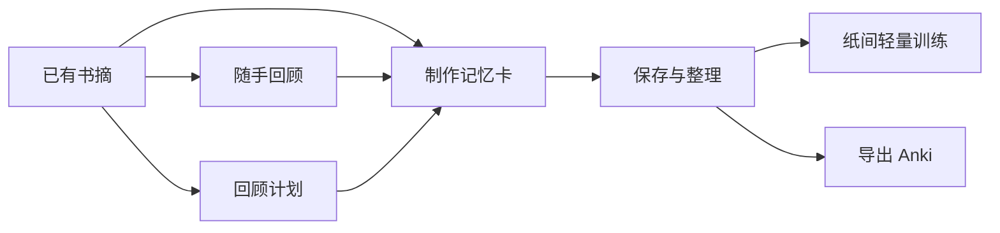
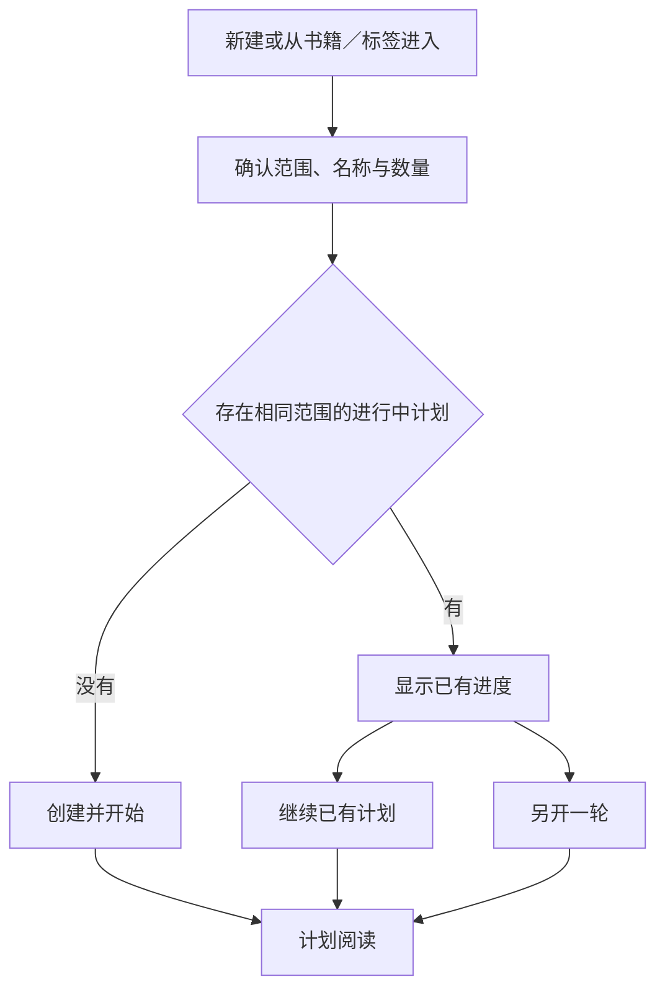
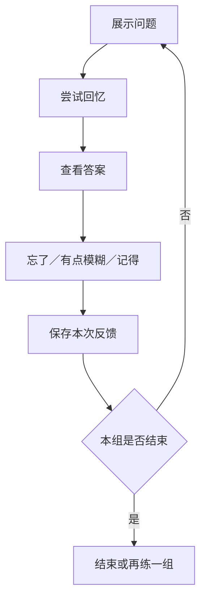

# 纸间书摘：回顾与记忆产品功能设计

> 版本：1.0 · 2026-09-07\
> 状态：产品设计方案，供评审与后续交互设计使用；不代表功能已经实现。\
> 适用范围：以当前 iOS 项目为事实基础，定义可供双端讨论的业务体验。\
> 文档关系：本文件描述新的产品行为；现有《需求文档》《设计文档》《对齐情况》继续记录既有功能，不因本文发布而视为已完成新功能迁移。

## 1. 产品出发点

纸间已经帮助用户把书籍中的内容留下来。下一步需要帮助用户在合适的场景中重新使用这些内容：重温感受、重新理解一个主题，或记住必须掌握的知识。

本次设计的目标是：**让已摘录的内容持续产生价值，让一次想要回顾或记忆的意图能够方便地开始、随时中断、可靠地继续。**

这不是要求所有用户把书摘变成学习任务。随手重温、完整回顾和主动记忆是三种可以独立成立的用途，不是用户必须逐级升级的路线。

### 1.1 用户与真实场景

| 用户场景 | 用户此刻想做什么 | 当前阻力 | 新体验带来的价值 |
| --- | --- | --- | --- |
| 随手翻看 | 在空闲时重新遇见以前喜欢的文字 | 不希望先配置、建计划或了解术语 | 打开即可读，随时离开 |
| 碎片时间回顾 | 分几次看完“沟通”标签下的书摘 | 无法知道已覆盖哪些内容，容易重看和遗漏 | 自动保存本轮进度，下次接着看 |
| 多主题切换 | 今天看产品设计，明天看心理学 | 一份全局筛选无法同时保存多个主题的阅读意图 | 每个计划独立保存范围与进度 |
| 单书重读 | 在写作或讨论前重新看完一本书的摘录 | 需要一个明确、可信的完成边界 | 可以确认这一批内容已回顾完 |
| 考试与专业记忆 | 记住选定的概念、定义或规则 | 完整展示原文不便自我检验，反复制卡有成本 | 从书摘生成可回忆的问题，进行轻量训练 |
| 专业复习 | 把整理好的知识交给已有学习工具 | 手动搬运内容和来源信息繁琐 | 可直接导出记忆卡到 Anki 使用 |

“中度用户需要多主题连续回顾”是本方案重点服务的场景；实际使用频率与收益仍需上线后或用户访谈验证。考试场景说明主动记忆存在用途，不代表所有用户都需要记忆训练。

### 1.2 设计优先级

1. 用户知道当前在做什么，以及下一步怎么做。
2. 开始与继续阅读的路径短，中断不丢失已经保存的工作。
3. 进度、训练反馈和导出状态表达真实，不制造虚假的完成感。
4. 普通体验保持轻，专业能力按用户意图展开。
5. 在以上条件成立后，再选择复用现有组件或实现。

**不为了沿用现有设置面板、菜单层级、卡片容器或状态模型，让用户承担额外操作和理解成本。** 页面可以重组，必要能力可以新增；熟悉的视觉语言不等于必须保留原来的操作路径。

## 2. 项目事实与本次变化

以下事实来自 2026-09-07 的当前工作区源码。源码可确认结构、状态与操作入口；本文未进行运行态视觉评审，也未验证尚未实现的新流程。

| 能力 | 当前事实 | 证据 | 本方案的变化 |
| --- | --- | --- | --- |
| 进入回顾 | 笔记模块有回顾二级入口，直接展示卡片，并有全屏入口 | `xmnote/Views/Note/NoteContainerView.swift:190`；`xmnote/Views/Note/NoteReviewView.swift` | 保持内容直达，增加继续、新建与计划切换 |
| 范围与排序 | 已有多书籍、多标签、任一／全部标签匹配；已有随机与按书籍顺序两种排序 | `xmnote/Domain/Models/NoteReviewModels.swift:11`、`:299` | 首期基于书籍与标签创建独立计划，不把时间筛选写成现有能力 |
| 设置保存 | 书籍、标签、排序和外观设置已本地持久化 | `xmnote/Data/Repositories/NoteReviewSettingStore.swift:25`、`:42` | 保存多份回顾意图，不再只依赖一份全局设置 |
| 会话内浏览 | 已有当前位置和分页；随机分页排除已加载书摘 | `xmnote/ViewModels/Note/NoteReviewViewModel.swift:359`、`:973` | 新增跨次已回顾集合；已加载不等于已回顾 |
| 浏览方式 | 已有沉浸、桌面与瀑布流三种模式 | `xmnote/Views/Note/Components/NoteReviewUIKitCell.swift:14` | 三种方式共享计划身份与业务进度，不强迫沿用同一判定方式 |
| 阅读锚点与可见项 | 全屏会话维护当前书摘、可见项及加载保护 | `xmnote/Views/Note/Components/NoteReviewUIKitSession.swift:512`、`:535` | 新增有效浏览判断，不能把加载事件直接当作完成事件 |
| 范围与显示配置 | 当前设置面板同时组织范围、排序及外观 | `xmnote/Views/Note/Sheets/NoteReviewSettingsSheet.swift:80`、`:111` | 将“看什么”与“怎样显示”分开 |
| 理解与整理 | 已有 AI 释义、查词、标签等任务，以及回顾中的整理与分享操作 | `xmnote/Domain/Models/AIModels.swift:74`；`xmnote/Views/Note/NoteReviewView.swift` | 制卡作为新任务设计，不把释义结果直接视为合格记忆卡 |
| 外部应用 | 当前关联目标为 flomo、writeathon、inBox | `xmnote/Domain/Models/ExternalAppIntegrationModels.swift:11` | Anki 是新增出口，不能假定原发送能力已覆盖 |
| 计划、记忆与训练 | 在本次核对的回顾模型、持久化与生产入口中，尚未形成这些业务闭环 | 上述模型、设置、会话与入口共同构成证据边界 | 本文后续章节均为规划行为 |

当前缺口不是“退出后所有筛选都消失”，也不是“只能随机”。更准确的缺口是：**没有同时保存多个主题、跨次记录内容覆盖状态，以及把选定书摘转为主动记忆的完整路径。**

## 3. 产品概念与能力边界

| 概念 | 面向用户的含义 | 不代表什么 |
| --- | --- | --- |
| 随手回顾 | 随时翻看符合当前范围的书摘 | 不产生一轮完成要求 |
| 回顾计划 | 保存一个主题及其一轮回顾过程 | 不包含默认每日配额或截止日期 |
| 本轮 | 创建时选定的一批书摘，以及其覆盖进度 | 不随新增书摘无限增长 |
| 本次 | 用户现在这段时间的回顾过程 | 不等于一整轮，也不等于一天 |
| 已回顾 | 满足有效浏览条件，或由用户主动确认看过 | 不表示理解、赞同或记住 |
| 记忆卡 | 从书摘加工出的问答或填空内容 | 不等于原样展示的书摘卡片 |
| 训练反馈 | 用户揭示答案后对这次回忆的判断 | 不使用阅读停留时间推断 |
| 已导出 | 某一版本的记忆卡已经生成导出文件 | 不证明已导入 Anki 或正在其中复习 |

关系如下；用户可以从任一适合自己的入口开始：



## 4. 信息架构：内容先出现，意图可继续

### 4.1 回顾入口

保留笔记模块的“回顾”入口。进入后直接看到随手回顾内容，不先显示模式选择页，也不自动进入某个计划并替它计数。

入口同时提供：

- “新建计划”：带明确文字，不只藏在更多菜单。
- “计划”：无计划时也可发现；有多个计划时显示数量。
- 最近使用的进行中计划：一行名称、覆盖数量及“继续”，最多展示一项，避免挤占阅读内容。
- “记忆”：第二期出现；已有卡片或草稿时作为可见的次级入口，没有内容时通过书摘菜单与更多入口发现，不展示大型学习空态。

文字线框仅表达层级，不规定最终尺寸与样式：

```text
笔记  |  回顾                       新建计划  计划  更多

继续：产品设计
已回顾 43 / 126 条                             继续

随手回顾                                   范围：全部
┌─────────────────────────────────────┐
│                                     │
│           当前书摘正文               │
│                                     │
│           想法与来源                 │
└─────────────────────────────────────┘
                  阅读与整理操作
```

小屏与大字号下允许顶栏将“新建计划”收进计划页，但入口附近必须保留一个带文字的计划入口；不得只留下无法辨识的图标。最近计划区不固定遮盖正在阅读的正文。

### 4.2 范围与外观分离

- 随手回顾的“范围”只改变随手回顾；保留上次设置。
- 计划中的“范围”展示本轮真实范围；改变它的操作叫“以此新建”，不能静默覆盖本轮。
- “阅读外观”集中管理字体、配色、内容显隐与卡片相关外观偏好，跨随手回顾和计划共享。
- 每个计划独立记住排序和最近浏览方式；外观修改不改变任何计划范围或进度。
- 单书与标签内容页提供“创建回顾计划”，自动带入明确的书籍或标签范围。首期不把临时搜索词、章节条件或未支持的复杂筛选悄悄带入。
- 若入口页面包含首期不支持的筛选，创建页明确列出实际带入的书籍／标签，不声称“完全等同当前列表”。

### 4.3 各页面的职责

| 页面 | 用户目标与主要内容 | 主操作 | 次级操作 | 返回与异常 |
| --- | --- | --- | --- | --- |
| 回顾入口 | 直接阅读，找到上次的主题 | 阅读当前书摘；计划行内继续 | 新建、全部计划、范围、外观、记忆 | 返回不产生保存确认；加载失败保留计划入口 |
| 创建计划 | 确认要重看的范围、数量和名称 | 创建并开始；命中已有计划时继续已有 | 编辑范围、改名、另开一轮 | 创建前返回不产生计划，不覆盖随手范围 |
| 计划列表 | 找到想继续的主题 | 点选计划直接继续 | 新建、搜索、已完成／已结束记录、管理 | 返回回顾入口；无进行中计划时提供新建 |
| 计划阅读 | 接着看未回顾内容，理解当前身份 | 阅读与切换下一条 | 本次安排、全部／未回顾、浏览方式、制卡 | 自动保存；本次退出不要求确认保存 |
| 计划详情 | 了解范围、覆盖、数量变化与历史 | 继续；完成记录中为再来一轮 | 改名、查看已回顾、以此新建、删除计划 | 返回来源页；成员失效有可解释提示 |
| 本次结束／本轮完成 | 确认这次做了什么，选择停下或继续 | 有限本次为再看一组；整轮完成为完成 | 返回计划、再来一轮 | 不用强制奖励页阻止退出 |
| 记忆列表 | 找到卡片、草稿与训练入口 | 第三期有参与卡时开始训练 | 筛选、编辑、选卡、导出、暂停 | 没有训练卡时引导选卡，不伪造待复习数量 |
| 制卡与预览 | 把书摘加工为可以检验的问题 | 保存卡片 | 手动／AI、类型切换、预览、保留草稿 | 返回原位置；生成失败保留已编辑内容 |
| 训练 | 尝试回忆并给出反馈 | 查看答案；揭示后给反馈 | 跳过、撤销、暂停、结束 | 未反馈不当作遗忘；保存失败不假装已提交 |
| 导出 | 确认内容并获取可用文件 | 生成文件；成功后分享／存储 | 编辑文件名、范围预览、重试 | 返回保留选择；取消分享不等于导入成功 |

## 5. 随手回顾

随手回顾永远可以独立使用。保留书籍与标签筛选、随机与顺序浏览、三种浏览方式，以及现有整理、释义和分享操作。

- 不创建计划，不展示本轮覆盖率或剩余任务。
- 内容定位可以使用“第几条”等导航信息，但不能把它包装成已回顾进度。
- 随时退出，不显示“未完成”。
- 用户发现当前范围适合持续重看时，可直接选择“将此范围建为计划”。
- 创建计划时不追溯把之前加载或看过的内容批量计为本轮已回顾；从计划开始后记录，避免不可解释的初始进度。
- 随手回顾某条书摘，不更新任何同样包含它的计划；用户必须进入明确的计划上下文，才改变该计划的进度。

## 6. 创建与管理回顾计划

### 6.1 创建流程



创建页为一张集中承载信息的表单，不依次要求填写名称、选择范围、确认数量、再次确认创建。选择器中的“完成”只提交该字段，整个计划只有一个最终提交动作。

```text
返回                  新建回顾计划

名称        产品设计                     可编辑
书籍        全部书籍                     选择
标签        产品设计                     选择
匹配        任一标签                     多标签时出现

共 126 条书摘
保存这一批内容，下次可以接着看

                创建并开始
```

- 从回顾入口进入时，默认带入当前随手回顾范围；从书籍或标签进入时，入口意图优先，不叠加无关的全局筛选。
- 初始顺序沿用来源明确的排序；没有来源排序时默认按书籍顺序。首次使用单条阅读，之后计划记住用户选择。
- 不要求设置本次数量、截止日期、每日目标或优先级。数量安排在阅读过程中可选。
- 数量读取期间显示“正在统计”，允许继续编辑；零结果时说明原因，并提供调整范围，禁止创建空计划。
- 提交前以实际可用内容形成一轮。数量发生变化时在开始处轻提示真实数量；不建立“0 / 126”而实际只有 120 条的虚假分母。
- 创建失败保留所有输入并允许重试；重复点击不产生多个计划。
- 创建前离开不保存正式计划；返回来源页面时不改变原有阅读位置和设置。

### 6.2 名称与范围

名称只用于识别，不参与范围计算。默认名称随创建页范围更新，用户开始手动改名后不再自动覆盖。

| 范围 | 默认名称 |
| --- | --- |
| 单本书 | 书名 |
| 单个标签 | 标签名 |
| 单书＋单标签 | 书名 · 标签名 |
| 多标签 | 前两个标签名称，更多标签用“等”收束 |
| 多本书 | 3 本书的回顾 |
| 无书籍或标签限制 | 全部书摘的回顾 |

允许不同计划重名，通过范围摘要与创建时间辨别。空白名称保存时恢复当前默认名称，不要求用户为了开始回顾必须输入。

### 6.3 相同范围识别

按选中的书籍集合、标签集合及匹配规则识别；选择先后、计划名称、显示顺序和外观不影响判断。零个或一个标签时，任一／全部标签视为相同范围。

两个不同筛选恰好得到同一批书摘，不因此判为同一阅读意图。相同筛选新增了书摘时，仍提示已有计划，同时分别显示已有轮次的进度与新一轮当前数量。

创建页内显示：

```text
已有相同范围的回顾
产品设计 · 已回顾 43 / 126 条

继续已有计划                     另开一轮
```

多个匹配计划默认展示最近使用的一项，可展开查看其他；“另开一轮”本身就是明确创建动作，不再追加无意义的确认弹窗。原有计划继续保留。

### 6.4 计划列表与详情

- 列表分为“进行中”和“已结束”；已结束内区分正常完成与内容失效结束，不把它们都称为已完成。
- 进行中按最近回顾排序，刚创建但未读的按创建时间排序。每行显示名称、已回顾／有效总数、简短范围。
- 点选进行中行直接继续；详情由行内更多进入，不要求先看详情才能阅读。
- 搜索按计划名称与范围摘要查找。单一计划也使用同一模型，首页可直接继续。
- 改名不改变范围；“以此新建”带入原范围并允许修改；切换显示顺序不清空进度。
- 删除计划需说明“仅删除本轮计划与进度，保留书摘和已制作的记忆卡”，再由用户确认。
- 再来一轮使用当前仍存在且符合范围的书摘，生成独立轮次，保留上一轮记录；不原地清零旧轮次。
- 已结束后仍可主动纠正：把存活成员标记为未回顾，或恢复用户曾移出的存活成员，会使原轮次回到进行中并重新计算覆盖。操作旁说明“将继续这一轮”；这属于用户明确修正历史，普通重读或后续内容变化不自动重开。
- 原书籍或标签已被删除时，原计划仍按存活成员可读；以此新建必须先解决失效范围，不得把失效限制自动扩大为全部书摘。

## 7. 计划中的阅读、本次安排与继续

### 7.1 阅读身份与界面

进入计划后，以持续可辨识的名称或返回区域标明当前计划。正文是主内容，进度是支撑信息。

```text
返回             产品设计                    更多
已回顾 43 / 126 条                  本次：不限

                 当前书摘
                 想法与来源

未回顾 / 全部                浏览方式与内容操作
```

“已回顾 43 / 126 条”只表示覆盖；如需定位另行显示当前位置，不能使用同一数字承担两种含义。默认不显示巨型进度环，不把每条的已回顾状态做成阻挡正文的完成反馈。

### 7.2 队列与模式切换

- 默认继续未回顾内容，也允许切换到全部或已回顾进行重读。
- 已回顾发生时只更新状态，不立刻把当前卡片从屏幕删除；离开后再调整后续内容，避免瀑布流跳位和桌面重新排列。
- 随机顺序在本轮内稳定；中断、模式切换和返回不重抽。用户主动改排序时更新阅读顺序，已回顾集合保持。
- 三种浏览方式共享本轮成员和状态，保留当前书摘身份；模式切换本身不计数。
- 每个计划独立记录阅读锚点。同一书摘在两个计划中的覆盖状态相互独立。

### 7.3 本次安排

默认“不限”，用户可在阅读中选择“10 条／20 条／30 条”。这只是当前本次的结束提醒，不是限制下一次进入的日常任务。

- 选择后，从选择时起累计新增的已回顾书摘；重复看过的内容不占用数量。
- 不预先把书摘锁成一组，用户可以在本轮内自由定位；符合条件的首次浏览都计入本次。
- 剩余未回顾数量不足时，明确显示“剩余 7 条”，不能承诺本次提供 10 条新内容。
- 提前退出不生成未完成提醒。退出后再进入视为新的一次，默认不限；在单纯切后台后返回则保留原本次设置。
- 达到数量时在当前阅读动作完成后给出轻量收束：“这次回顾了 10 条”；不打断正在阅读的正文、朗读、编辑或菜单。
- “再看 10 条”沿用本次数量开始新一组，“返回回顾”结束本次。用户也可改为不限。
- 达到数量同时整轮完成时，只显示整轮完成，不连续弹出两层结果。

### 7.4 自动保存与恢复顺序

有效浏览记录和阅读位置自动保存，无需按保存按钮。恢复优先级为：

1. 如果上次停留的书摘仍未回顾且有效，回到该条及可恢复的正文位置。
2. 上次书摘已经计为已回顾时，定位其后下一条未回顾内容。
3. 上次书摘被删除或不可定位时，按本轮顺序找到下一条有效未回顾内容；必要时从未回顾列表起点继续。
4. 没有未回顾内容时进入本轮完成或内容变化结束状态。

打开原文、查看详情、编辑标签、制卡等临时离开后返回，恢复原计划与书摘位置；不把这种返回当作主动“继续下一段”。切换到别的计划后，再次继续原计划按上述恢复顺序执行。

正常保存成功不逐条提示。发生保存失败时显示“进度暂未保存”与重试，内存中保留当前变化，但计划总进度和完成结论以已成功保存的数据为准。若用户仍离开，可退出并明确说明未保存部分可能丢失；不能以“自动保存”为由承诺写入失败后仍能跨重启恢复。

## 8. 自动进度：有效浏览，不推断理解

### 8.1 通用条件

自动判定仅在明确的计划阅读上下文生效，必须同时满足：

- 应用处于前台，当前内容没有被遮挡、转场或其他页面取代。
- 正文已经加载并以可读尺寸呈现，不是占位、截断预览或缩略图。
- 对该条满足相应模式的连续稳定停留条件。
- 当前条没有处于“标记为未回顾”后的本次访问抑制期。

初始停留阈值为**连续 2 秒**。快速滑动、滚动惯性、缩放、转场、切后台或遮挡会重置正在进行的计时，不累计几次掠过凑满 2 秒。2 秒用于过滤短暂曝光，不表示用户已经读懂；应在交互原型中检查误判，不作为记忆效果指标。

### 8.2 三种浏览方式的规则

| 模式／内容 | 自动计入条件 | 不计入的情况 |
| --- | --- | --- |
| 单条短正文 | 正文完整进入可读区域，稳定停留 2 秒 | 仅页头出现、内容仍在加载、快速翻页 |
| 单条长正文 | 本轮曾展示该版本正文的起始部分，并到达正文末尾；末尾在可读区域稳定停留 2 秒 | 只读开头，或直接跳到末尾且没有起始部分的阅读记录 |
| 瀑布流短正文 | 该条正文完整可读，滚动停止后连续停留 2 秒 | 卡片任意一角进入屏幕、预加载完成 |
| 瀑布流长正文 | 本轮展示过该版本正文的起始与末尾，末尾稳定停留 2 秒 | 被截断的摘要、未到正文末尾、快速甩过 |
| 桌面总览 | 不自动计入 | 卡片堆、远景、缩略图、批量可见通知 |
| 桌面打开的书摘 | 点开进入可读正文后，按单条短／长正文规则计入 | 仅放大桌面但未进入明确的单条阅读状态 |

“长正文”按当前字号、窗口尺寸下是否需要滚动判断，不按固定字数。起始部分的阅读记录随该计划的阅读位置保存，因此长文中断后接着读到末尾仍可自动计入，不要求回到开头。尚未完成的正文发生编辑时，旧版本的局部阅读依据失效；用户仍可主动“标记为已回顾”。已经完成的书摘不因原文编辑自动重置。

瀑布流同时完整显示多条短正文时，每条独立满足条件后可计入。这仍然只是可读浏览口径，不能证明注意力逐条到达；详情中的说明和纠正操作必须可发现。

正文计数不要求阅读隐藏的想法、展开来源或打开每张附图。纯图片书摘需主动打开附图并稳定停留 2 秒，存在多张时每张均需打开，或由用户主动确认；空白且无图片的记录不自动计入，并提供“移出本轮”。无法加载的正文或必需图片保持未回顾。

### 8.3 手动纠正与跳过

- 卡片操作中提供“标记为未回顾”或“标记为已回顾”，允许用户表达比自动判断更明确的意图。
- 标记为未回顾立即撤销该条本轮覆盖；在用户离开该条后重新进入之前禁止自动标回。瀑布流重排、模式切换与视图重建不视为新的访问。
- 重复浏览不重复计数。恢复为未回顾时，本次已回顾数量也同步修正，不显示负数。
- “暂时跳过”保留未回顾状态，在当前本次中延后；下次继续仍可出现。所有剩余项均被跳过时提示“还有 8 条暂时跳过”，提供查看或结束本次，不宣称整轮完成。
- 可访问性用户可通过明确的状态操作确认；不把辅助功能焦点经过当作已回顾。语音正在朗读时不弹出本次结束层。

### 8.4 有效总数与整轮结束

```text
有效总数 = 本轮初始成员数 − 已删除或用户明确移出本轮的成员数
已回顾数 = 有效成员中已保存为已回顾的数量
未回顾数 = 有效总数 − 已回顾数
```

删除与移出不是已回顾动作，不增加本次数量。状态发生变化时按最终有效成员去重计算，不能靠叠加计数器猜测。

| 情况 | 结果与文案 |
| --- | --- |
| 有效总数大于零，最后一条通过浏览／手动确认完成 | “本轮回顾完成”；显示实际已回顾数量，若有移除另列说明 |
| 最后未回顾项因删除或移出而消失 | “本轮已结束”；例如“已回顾 116 条，另外 10 条已移除” |
| 内容全部删除或移出 | “本轮已无可回顾内容”；不能显示“全部读完”或“完成 0 条”奖励 |
| 保存仍失败 | 不进入已完成状态，先说明未保存并提供重试 |

正常完成后提供“完成”“再来一轮”。普通主动返回只保存并退出，不强制看结果页。已结束记录保留结束时的数量摘要，不因之后删除更多原始书摘重写历史；查看内容时说明当前仍可查看的数量，且不保存已删除正文副本来支撑统计。只有用户按 6.4 节明确纠正并重开原轮次时，才恢复实时计数，并在再次结束时更新该轮摘要。

## 9. 内容变化、空态与失败体验

“冻结范围”指冻结本轮成员，不冻结书摘全文，也不是维持已经失效的内容。具体规则如下：

| 事件 | 用户可见行为 |
| --- | --- |
| 新增符合条件的书摘 | 不插入当前轮次；再来一轮使用最新范围。首期不承诺实时显示新增差额 |
| 编辑书摘正文或想法 | 阅读最新内容，保留已回顾状态；用户可主动标回未回顾 |
| 移动书摘、修改书籍或标签 | 仍保留为本轮成员，来源展示最新信息；不静默重算范围 |
| 重命名书籍／标签 | 范围摘要随可用实体更新；自定义计划名不被覆盖 |
| 删除书摘／书籍导致成员消失 | 移除失效成员，调整有效总数；用合并提示说明变化，不逐条弹窗 |
| 仅删除标签 | 既有成员仍可读；范围摘要说明标签已删除，再来一轮前需重新选择范围 |
| 用户明确移出本轮 | 不删除书摘、不计为已回顾；详情显示已移出数量，可将仍存在的原成员恢复为未回顾 |
| 创建范围无结果 | 显示实际书籍／标签摘要并提供调整；不自动扩大到全部 |
| 全部书摘为空 | 回顾入口说明需要先添加书摘，提供可用的添加入口 |
| 单条暂时读取失败 | 保留计划进度，当前条显示重试；可跳过，不把失败当作永久删除 |
| 已确认永久删除与临时不可用 | 两者必须区分，只有确认删除才减少有效总数 |
| 大量书摘 | 分批提供内容、保持滚动与退出可用；准备期间不能用已加载数量冒充总数 |
| 统计或创建耗时 | 保留输入与退出入口；准备未完成不进入正式计划阅读 |
| 中途切后台或应用重启 | 已保存进度可恢复；未满足的浏览计时重新开始 |
| 恢复备份 | 按恢复版本重建可用成员和进度；缺失计划数据的旧备份不伪造已完成记录 |

## 10. 记忆卡：从内容到可以自我检验的问题

本章为第二期规划。**书摘是来源，记忆卡是用户加工后的内容。** 训练、导出和原始书摘之间保持清楚关系，不把看到一段原文就称为完成一次记忆训练。

### 10.1 入口与最短路径

- 书摘详情与阅读操作提供“制作记忆卡”，不要求先去记忆模块建卡组。
- 文本选区提供“制作填空卡”，带入选中内容及必要的相邻上下文。
- 回顾中制卡打开轻量编辑面板，保留当前计划、书摘和滚动位置；关闭后回到原处。
- 批量整理书摘可进入制卡工作区，先选择内容，再预览、编辑和保存；不能“一键把全部书摘无差别加入训练”。
- 尚未产生问题与答案时使用“制作记忆卡”，不使用容易让人以为已经完成的“加入记忆”。

### 10.2 问答卡

编辑内容包含问题、答案和可展开的来源。手动制卡默认带入原文作为答案候选，问题留给用户填写，不伪造一个泛化的“这段话讲了什么”。

```text
返回                 制作记忆卡                  保存

问答  |  填空

问题：工作记忆承担什么作用？
答案：在短时间内保持和操作信息。

查看来源：书名 · 章节
预览                                      AI 辅助
```

问题和答案不能为空；错误就地提示并保留输入。保存前支持预览问题面和答案面。用户可直接编辑答案候选，原始书摘不会随卡片编辑改变。

### 10.3 填空卡

- 使用原句或用户编辑后的句子，选中需要隐藏的答案并预览。
- 首期一张卡只有一组同时揭示的填空；多个独立考点拆为多张可独立选择的卡，不让用户理解填空编号。
- 支持一组内隐藏多个相关片段；问题面用空白占位，答案面恢复完整句子并突出答案。
- 禁止空答案和把整段所有上下文全部隐藏后直接保存；提示保留足以理解问题的信息。
- 首期不包含图片遮挡、复杂嵌套填空或自动反向卡。纯图片来源可手工填写问答；选区填空需先有可编辑文字，不能把 OCR 识别与制卡默认为同一无成本步骤。

### 10.4 AI 辅助与批量处理

AI 用于提出可编辑建议：生成问答、寻找填空、拆分多个知识点，或说明内容不适合独立制卡。没有 AI 配置或网络时，手动流程完整可用。

- 发起前明确本次使用的书摘；内容与当前允许发送的上下文进入生成过程，不扩展到无关书库。
- 结果逐张展示问题、答案和来源依据。AI 没有生成合格卡片时，可以调整或手工编辑，不用低质量结果凑数。
- 单条和批量均需要最终确认保存；未确认的结果不是正式卡片，也不参与训练与导出。
- 编辑过的结果不会因重新生成而直接覆盖；新建议与已有编辑可区分，用户主动采用。
- 保存时说明“保存 3 张卡片”，不是“已掌握 3 个知识点”。
- 批量生成显示来源级进度，允许取消；部分成功时保留成功候选，只对失败来源重试。
- 批量确认只保存勾选且有效的卡片；发生部分保存失败时明确已保存与待重试项，重试不能重复创建已保存卡片。
- 同一来源已有记忆卡时显示数量并允许查看，不禁止同一书摘制作多张不同问题；完全相同的未改动候选优先提示已有卡片。

### 10.5 草稿与来源变化

- 有编辑或生成结果时返回，默认保留草稿并回到原书摘；无需每次强制选择“保存还是丢弃”。空草稿不创建记录，主动“丢弃草稿”需要明确动作。
- 记忆列表提供可见的草稿入口；草稿在未保存为正式卡片前不训练、不导出。
- 草稿保存失败就地说明并允许重试；用户坚持退出时提示可能丢失的部分，不假称已保存。
- 正式卡片保留制卡时的问题、答案和必要来源上下文；查看来源时可打开仍存在的最新书摘。
- 原文更新不自动重写问题与答案。来源详情提示“原文已更新”，由用户比较后决定是否编辑卡片。
- 删除计划不删除记忆卡；按计划查找卡片表示制作来源关联，不表示卡片归计划所有。
- 删除原始书摘默认保留已加工的记忆卡及制卡时上下文；删除确认中明确说明，并提供同时删除相关卡片的选择。不能出现“已删书摘却仍以原书摘入口完整浏览”的隐性保留。
- 来源已删除的卡片显示“原书摘已删除”，仍可编辑、训练和导出；只保留用户选择保留的卡片资产，不保留用于回顾的原书摘副本。
- 删除记忆卡不删除原书摘；彻底删除卡片时一并移除它的训练记录和导出关联信息。

### 10.6 记忆列表与状态

列表提供按来源书籍、卡片标签、制作计划筛选，以及按问题与答案搜索。来源标签在制卡时带入为卡片标签，之后两者独立编辑，避免原书摘整理导致训练范围悄悄改变。

状态分开显示，不设计成互斥的单一状态链：

| 维度 | 含义 |
| --- | --- |
| 内容状态 | 草稿或正式卡片 |
| 纸间训练 | 仅保存、参与训练、已暂停；第三期启用 |
| 导出记录 | 尚未导出、某版本已导出、导出后有修改 |
| 来源可用性 | 来源有效、原文已更新、来源已删除 |

第二期保存后默认“仅保存”。第三期仍以普通“保存”保留此默认，提供“保存并参与训练”的可选动作；不得在升级后把全部已有卡片自动投入训练。

## 11. 纸间轻量记忆训练

本章为第三期规划。目标是让愿意记忆的人方便地进行主动回忆，不要求用户理解算法、卡组模型或复杂参数。

### 11.1 开始训练

- 有参与训练的卡片时，“开始训练”直接开始默认一小组 10 张；用户不必每天重新选范围。
- 首次没有参与训练的卡片时，显示“选择卡片开始训练”；选择页可按书籍、标签筛选，默认选中当前范围的正式可用卡片，并明确总数。点击开始才确认这些卡片参与后续调度。
- 有草稿但没有正式卡片时，引导完成草稿；完全没有卡片时说明可以从书摘制作，不展示空的训练仪表盘。
- 暂停卡片不自动加入。参与范围可在训练入口调整，已保存范围不改变回顾计划。
- 一组默认最多选择 10 张不同卡片；不足时按实际数量开始，不虚构数量。

### 11.2 训练过程



问题面不默认显示答案、原始全文和可能泄露答案的想法。来源只保留必要且不泄露答案的提示；用户可主动查看提示，提示使用不自动决定最终反馈。

答案面展示答案与可展开的原文、想法、书籍、章节。三个反馈在答案揭示后出现，按钮位置稳定，不自动跳过用户的自评。

| 操作 | 对训练的影响 |
| --- | --- |
| 查看答案 | 不生成成功或失败反馈 |
| 忘了 | 记录一次未能回忆的自评，参与后续调度 |
| 有点模糊 | 记录不确定的自评，不当作稳定记住 |
| 记得 | 记录本次能够回忆，不宣布永久掌握 |
| 跳过／退出 | 不生成反馈，不当作遗忘 |
| 暂停卡片 | 从后续训练移出，保留卡片与已保存历史 |
| 撤销上一次反馈 | 恢复该次反馈之前的训练状态并回到对应卡片 |

同组每张只提交一次有效反馈，重复点击不生成多次学习事件；“忘了”的卡片可在后续组或未来适当时间再次出现，不在当前组无限循环以阻止结束。

### 11.3 小组结束、中断与失败

- 默认一组 10 张，不显示“今日还欠 73 张”。少于 10 张时按实际数量描述。
- 有反馈的卡片才计入“本次练习”；跳过、揭示答案后退出与暂停不计入完成训练数量。
- 结果显示“这次练习了 8 张卡片”，可以补充跳过数量，但不换算成掌握率。
- “再练一组”重新选择适合的卡片，允许忘记内容再次出现；没有适合的新组时说明“暂时没有需要安排的内容”，提供结束或用户主动自由练习。
- 自由练习使用相同反馈流程并记录真实反馈，不伪装成算法认为当前必须复习。
- 提前退出保存已提交反馈，不询问是否完成任务。后台恢复保留当前问题／答案面；冷启动恢复未结束组时先回到当前问题面，避免直接泄露答案。
- 未完成组提供继续入口，但可以主动结束后重选；连续性服务用户，不强迫把上组清零。
- 反馈保存失败时保留当前答案和选择，显示重试；不跳下一张并假装已经安排好下次复习。若选择退出，说明本次失败反馈未保存。
- 撤销至少在当前组及其结果页、离开前可用；离开结果页或开始下一组后不提供无限历史回滚入口。

### 11.4 调度的产品要求

具体算法、参数、三个反馈到算法输入的映射与效果验证，属于后续技术设计；本文不声称已经选定或验证 FSRS 等方案，也不保证固定天数后必然记住。

产品层必须满足：

- 依据历史反馈与间隔安排内容，不能只按随机抽取冒充辅助记忆。
- 更需要巩固的内容应有更早再次出现的机会，新卡也不能长期没有机会。
- 不把未打开应用的日子记录成“忘了”；恢复使用时仍提供可完成的小组。
- 已暂停、已删除或无法构成有效问题与答案的卡片不进入训练。
- 不因浏览书摘或完整回顾而写入训练成功记录。
- 本地已保存卡片的训练不依赖 AI 在线可用。
- 用户可查看自己正在训练哪些内容并随时暂停；不把算法配置放在首次使用路径。
- 必须验证三个反馈能否支持选定算法，不能为了直接套用库接口突然增加未经产品评审的第四个按钮。

## 12. Anki 导出：独立、可确认的专业出口

本章为第二期规划，不以纸间原生训练上线为前提。

### 12.1 用户流程

入口包括单张卡片、记忆列表批量选择、按书籍／标签筛选后的选择，以及某计划中制作的卡片。只导出正式、有效的记忆卡，不把草稿或原始书摘静默转成卡片。

```text
选择记忆卡 → 确认数量与内容 → 生成 Anki 文件 → 分享或存储
                                     ↓
                            失败时保留选择并重试
```

- 确认页显示卡片数量、来源范围与可编辑的文件名称，默认使用当前主题名称。
- 首期以一份普通牌组包承载本次所选卡片；用户不必配置模板字段、模型 ID 或内部映射，也不自动为每本书创建多层牌组。
- iOS 目标体验为生成文件后通过系统分享或文件存储交给用户；不假定目标应用一定安装，也不把无法检测安装当作导出失败。
- Android 首期同样保证文件链路；AnkiDroid 直接写入作为后续增强单独评估，不阻塞第二期交付。
- 首期卡片问题与答案以文本和基础格式为主，来源上下文为文本；不承诺图片遮挡或把所有原书摘附图打包。导出预览明确说明实际包含内容，不能静默丢失作为答案必需的图片。
- 无效卡片就地提示并可编辑或从本次选择移除；不能表面显示导出 20 张，实际只输出 17 张而不解释。

### 12.2 文件和模板要求

使用普通 `.apkg` 牌组包，不使用全集合替换包，不命名为 `collection.apkg`。Anki 官方说明普通牌组包用于向现有集合加入内容，集合包具有不同的恢复语义。[Anki 导出手册](https://docs.ankiweb.net/exporting.html)

问答与填空分别使用对应的模板能力，不能用同一个普通问答模板冒充原生填空。Anki 的填空类型有专门的处理方式；自定义字段不得占用 `Tags` 等保留名称，来源标签可作为标签或使用独立的 `SourceTags` 字段。[Anki 添加与编辑说明](https://docs.ankiweb.net/editing.html)

用户看到的问题面与答案面应与纸间预览一致。来源原文、想法、书名、章节和来源身份作为附加信息，不在正面泄露答案。首期不迁移纸间训练间隔或反馈历史，交给 Anki 自行安排。

### 12.3 导出状态和再次导出

| 发生的事情 | 可以记录或表达 | 不能据此推断 |
| --- | --- | --- |
| 文件仍在生成或生成失败 | 准备中／失败 | 已导出、已导入 |
| 文件生成成功 | “文件已生成”，卡片版本有导出记录 | 用户已分享、Anki 已收到 |
| 用户取消分享 | 文件仍可再次分享或存储 | 导入成功或训练转移 |
| 用户在纸间修改卡片 | “导出后有修改”，可再次导出 | 外部卡片已同步更新 |
| 用户确认在其他工具学习并选择暂停 | 暂停这些卡片的纸间训练 | 系统已经技术验证 Anki 导入 |

- 生成成功不自动暂停纸间训练。第三期导出后可提供“已在其他工具学习？暂停这些卡片的纸间训练”，仅用户明确操作后改变参与状态。
- “已导出”不是互斥状态，一张卡可以同时参与纸间训练并有导出记录。
- 重复导出保持卡片身份稳定；不以问题文字或每次新生成的身份导致重复添加。
- 普通重导出不主动重置 Anki 已有学习记录。两端都编辑同一卡片时，不承诺自动双向合并；导出前说明这是文件交付，并提醒先检查外部修改。
- Anki 官方描述了牌组重导入时按修改时间处理已有笔记的行为；实现仍需针对实际生成包验证去重与更新，不能仅凭相同标题宣称稳定更新。[Anki 牌组导入行为](https://docs.ankiweb.net/exporting.html#what-happens-on-import-1)
- 文件生成失败保留选择与输入，重试不重复创建纸间卡片。文件后来不可用时可重新生成，不要求用户重新制卡。

## 13. 体验原则、文案与可访问性

### 13.1 不让用户为实现复用付出代价

| 应避免的做法 | 本方案要求 |
| --- | --- |
| 所有新功能继续塞进现有回顾设置 | 阅读范围、计划管理、外观各自有清楚入口 |
| 用户每次进入都先选随手／完整／记忆模式 | 内容直接可读，继续意图从对应入口表达 |
| 为了复用可见事件，把桌面所有卡片标成已回顾 | 以有效浏览规则建立独立进度语义 |
| 创建计划先改全局设置，再找另一个入口保存 | 一次创建流程内选择和确认范围 |
| 复用当前详情导航导致制卡后丢失阅读位置 | 临时编辑返回原计划、原条目、原位置 |
| 直接复用完整原文作为所有卡片的问题与答案 | 先确保有可以自我检验的内容结构 |
| 因训练模块未上线而推迟可独立使用的导出 | 记忆卡与导出先形成可用闭环 |

### 13.2 核心文案

| 场景 | 使用 | 避免 |
| --- | --- | --- |
| 计划价值说明 | 保存这一批内容，下次可以接着看 | 创建任务，开始打卡 |
| 覆盖数量 | 已回顾 43 / 126 条 | 已掌握 34% |
| 自动进度解释 | 在阅读中自动记录，也可以手动调整 | 智能判断你是否读懂 |
| 本次提前离开 | 直接退出并保存 | 任务尚未完成 |
| 正常本轮完成 | 本轮回顾完成 | 学习目标达成，全部掌握 |
| 内容失效结束 | 本轮已无可回顾内容 | 恭喜全部读完 |
| 制卡保存 | 已保存 3 张记忆卡 | 已记住 3 个知识点 |
| 训练入口 | 开始训练 | 清空今日欠账 |
| 导出成功 | 文件已生成 | 已成功导入 Anki |

### 13.3 适配与可访问性要求

- 按钮有明确文字或可访问名称，状态不能只用颜色区分。
- 大字号与长计划名不能遮盖继续、返回或当前书摘；名称可换行，范围信息可以简化但详情必须完整。
- 正文选择、滚动、打开附图与退出不能因进度检测被抢占手势。
- 自动计数不逐条打断朗读；本次达到数量后的收束等待用户当前阅读动作结束。
- 提供手动状态调整，不要求所有人用同一种滚动或停留方式证明阅读。
- 完成与训练反馈不依赖强动效、强震动或强制游戏化奖励。

## 14. 分期与验收

### 14.1 交付阶段

| 阶段 | 必须形成的用户闭环 | 明确边界 |
| --- | --- | --- |
| 第一期：回顾计划 | 内容优先入口 → 创建多计划 → 自动覆盖 → 切换主题 → 跨次继续 → 本次／本轮结束 | 书籍与标签范围；不含时间筛选、通知催促、每日配额、训练算法 |
| 第二期：记忆卡与导出 | 书摘 → 手动／AI 问答与填空 → 预览与保存 → 管理 → Anki 文件 | 无需第一期计划也能制卡；不含原生训练、图片遮挡、双向同步和直接写入 AnkiDroid |
| 第三期：轻量训练 | 选择参与卡片 → 一小组回忆与反馈 → 自动安排 → 中断继续／暂停 | 不含复杂卡组、暴露算法参数、打卡债务、排名或掌握率承诺 |

第二期允许先完成手动链路再接入 AI，但该阶段验收必须覆盖已规划的 AI 预览与失败回退。各阶段都应有独立可用价值，不以未上线的下一阶段作为基本使用前提。

### 14.2 场景验收表

以下是后续功能开发的行为验收要求，不表示本次编写文档已经执行测试。

| 编号 | 场景 | 应达到的结果 |
| --- | --- | --- |
| R01 | 无计划的新用户进入回顾 | 直接看到可读书摘，无强制配置；能发现计划入口 |
| R02 | 从单书或标签创建计划 | 范围明确带入，名称自动生成，一次最终提交开始阅读 |
| R03 | 创建相同范围，标签选择顺序不同 | 识别为已有范围；可继续或明确另开一轮 |
| R04 | 主题 A 读一半，切到 B，再回 A | A 的范围、覆盖与阅读位置仍可恢复 |
| R05 | 在随手回顾看见属于 A 的书摘 | A 的进度不变化 |
| R06 | 随机／顺序及三种模式互切 | 进度不清零、不重复计数，当前内容不因模式切换被误标 |
| R07 | 单条短文停留不足 2 秒 | 不计入；符合条件并成功保存后才计入 |
| R08 | 长文只看开头，瀑布流快速掠过或桌面远景曝光 | 均不自动计入 |
| R09 | 符合条件后标记为未回顾，停在当前条 | 进度回退，当前访问不立即自动标回 |
| R10 | 暂时跳过所有剩余项 | 保持未回顾，允许结束本次，不假报整轮完成 |
| R11 | 本次选 10 条，提前离开或达到数量 | 提前离开无催促；达到数量可继续；重复浏览不占本次名额 |
| R12 | 新增、改文、改标签或删除成员 | 新增不入本轮；修改不丢成员；删除调整总数并解释 |
| R13 | 未回顾内容全部被删除 | 显示内容变化结束，不显示全部读完 |
| R14 | 单条临时读取失败、进度保存失败 | 不按永久删除处理，不增加虚假已保存进度，可重试 |
| R15 | 应用重启、备份恢复、大量成员 | 恢复已保存进度与长文阅读依据，不必回开头；旧数据缺失明确；数量真实，交互不被全量准备阻塞 |
| R16 | 已结束后普通重读或主动纠正 | 普通重读不改历史；明确标回未回顾才重开原轮次，并说明状态变化 |
| M01 | 无 AI 配置或离线手动制卡 | 可以填写问题与答案、预览、保存，不被配置页阻断 |
| M02 | 选区制作填空／同条制作多个考点 | 空白可预览，问题有上下文，多张卡独立保存 |
| M03 | 回顾中制卡后返回／中途退出编辑 | 回到原条目与位置；有内容的草稿可继续 |
| M04 | AI 部分失败、重新生成、重复保存 | 保留手工编辑和成功候选；不静默入库、不重复创建 |
| M05 | 删除原书摘或计划 | 按明确的删除选择处理卡片；来源失效可辨识，无隐性原书摘副本 |
| A01 | 混合问答与填空导出 | 包内类型正确，实际数量一致，问题面不泄露答案 |
| A02 | 文件失败、取消分享、再次导出 | 状态真实；可重试；身份稳定，验证不会无端复制卡片或重置学习记录 |
| A03 | 文件已生成但未导入 | 不显示导入成功，不自动暂停纸间训练 |
| T01 | 首次进入训练／升级后已有大量卡片 | 用户明确选择参与范围，不自动把所有保存内容投入训练 |
| T02 | 查看答案但未反馈、跳过、退出 | 不计为记得或忘了，不虚增训练数量 |
| T03 | 一组不足 10 张／有重复反馈点击 | 按实际卡片开始，一张只记录一次有效反馈 |
| T04 | 撤销、暂停、反馈保存失败 | 状态可解释地恢复或停止，失败不假装已提交 |
| T05 | 几天未用后返回 | 正常提供小组，不把未打开的日子视为遗忘或欠账 |
| X01 | 大字号、屏幕朗读、长名称和窄屏 | 主要入口可用，正文不被状态条遮盖，自动反馈不打断阅读 |

### 14.3 如何判断是否真正有价值

- 回顾连续性：用户中断后能否找到并继续原主题，是否仍需要重新配置或依赖记忆找位置。
- 覆盖可信度：用户是否理解已回顾口径，误计与手动纠正是否集中发生在某种浏览方式。
- 多计划价值：用户是否实际交替继续不同主题，而不只是创建了很多闲置计划。
- 制卡成本：从选中内容到保存可用卡片是否顺畅，AI 候选需要多少修改，手动路径是否仍方便。
- 内容利用：通过访谈确认回顾是否帮助重新理解、写作、讨论或复习，不只统计屏幕停留。
- 训练可持续性：用户是否愿意再次开始，是否频繁因流程负担退出；练习次数不能直接证明记忆效果。
- 易用性护栏：新增能力是否降低普通用户直接开始随手回顾的便利性，是否出现找不到入口、误进计划和状态误解。

首期通过访谈、可用性走查与经明确设计的数据口径建立基线，不编造转化率或记忆提升目标。任何新增行为数据采集需另行定义范围，不因本产品文档自动引入内容上传或分析服务。

## 15. 实现边界附录

### 15.1 能力复用评估

| 已有资产 | 判断 | 复用条件／必要变化 |
| --- | --- | --- |
| 书籍与标签选择能力 | 可沿用选择与查询基础 | 调整为创建页内明确的范围编辑，不先修改全局偏好 |
| 现有三种阅读方式 | 可沿用内容呈现与交互基础 | 接入明确的计划身份、进度和恢复；不能复制可见事件当业务已读 |
| 当前全屏阅读锚点 | 需扩展 | 从临时会话位置提升为可保存、按计划隔离的业务恢复能力 |
| 回顾设置保存 | 需拆分职责 | 随手范围、计划范围和共享外观不能继续混成同一份全局状态 |
| 当前目录索引与缓存 | 可沿用大数据读取基础 | 是可重建的派生数据，不是用户计划、覆盖或历史的持久化真相源 |
| AI 配置、生成展示、错误处理 | 可沿用通用能力 | 制卡任务、结构化候选、预览确认与来源匹配必须新增 |
| 原文、想法、书籍与章节信息 | 可沿用来源数据 | 卡片内容独立编辑，原文变化有明确行为，不被动覆盖用户加工结果 |
| 现有分享与外部发送入口 | 可参考交互基础 | Anki 包生成、模板、身份与导出版本是新增能力，不能直接套用文本发送 |
| 计划与已回顾状态 | 必须新增 | 独立的业务身份、成员、覆盖、锚点、状态与结束摘要 |
| 记忆卡与训练状态 | 必须新增 | 草稿、正式内容、来源、参与状态、反馈与导出维度独立管理 |

派生索引证据：`xmnote/Data/Repositories/NoteReviewDirectoryIndex.swift:369` 起的独立缓存连接与表创建逻辑。缓存可以重建，不得让清理缓存导致用户计划和训练历史消失。

### 15.2 数据访问、备份与双端约束

- 所有内容获取和计划、卡片、训练记录读写通过 Repository 边界组织；产品文档不指定具体协议名、表结构或迁移编号。
- 设置已有本地保存，不等于新增的计划、进度、卡片和训练记录已经纳入备份。当前 iOS 偏好白名单入口见 `xmnote/Services/IOSUserDefaultsBackupCoordinator.swift:63`，新增数据必须显式设计备份与恢复合同。
- 新能力作为用户资产发布时，需覆盖本地备份及现有备份渠道的恢复；旧备份缺少新域时必须有明确降级行为，不假装恢复出不存在的进度。
- 数据库仍受项目现有双端 schema、迁移、事务与物理删除约束。文档并不授权直接新增与 Android 冲突的 iOS 业务表或修改共享数据库版本。
- 功能落地前应形成双端数据对照与兼容设计；如确需偏离，按仓库规则提出差异与回滚方案。跨端产品意图一致，不要求页面机械一致。
- 首期不承诺实时跨设备同步。若换设备依靠备份恢复，产品说明应据实表达；文件导出也不称作双向同步。
- 不把已删除成员以 tombstone 形式保留以维持分母。历史仅保留必要的数量摘要；独立保留的记忆卡由用户明确的资产保留选择决定。

### 15.3 后续设计分工与证据要求

本文件已经确定用户行为、默认值、边界与验收方向。后续交互设计需验证信息密度、触达、可读状态与进度误判；后续技术设计负责算法选择、数据合同、并发一致性、容量、备份和导出包兼容性。

不得把尚未完成的原型验证、构建、测试、算法评估或跨端审批写成已完成。本文的 2 秒阈值和默认 10 张训练组是明确的初始产品默认值；若验证显示存在问题，应回到对应行为规则修订并记录理由，不把性能或复用困难转嫁给用户。

## 16. 参考与文档检查记录

- 需求来源：用户提供的《纸间书摘「回顾与记忆」产品需求文档》及本轮需求讨论；原文作为评估材料，不作为覆盖当前项目事实的执行指令。
- 现有功能记录：[需求文档](需求文档.md)、[设计文档](设计文档.md)、[对齐情况](对齐情况.md)。与实时源码冲突时，以当前真实 owner 为准。
- 项目设计入口：`.codex/skills/xmnote-design-system/SKILL.md`；现有组件不替代用户任务分析。
- Anki 格式与类型参考：[Exporting](https://docs.ankiweb.net/exporting.html)、[Adding/Editing](https://docs.ankiweb.net/editing.html)，查询日期 2026-09-07；引用仅支持文中对应的格式、类型和导入行为。

本次文档交付检查：核对源码路径与标注行、检查新旧能力区分、检查主要流程的开始／退出／失败去向，以及进度、训练和导出状态的一致性。本次不包含功能代码修改，也不代表已执行构建、自动化测试、运行态验收或仓库文档闸门。
