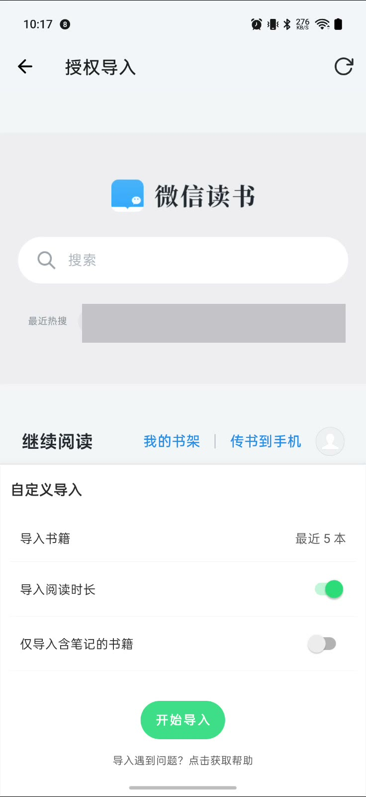
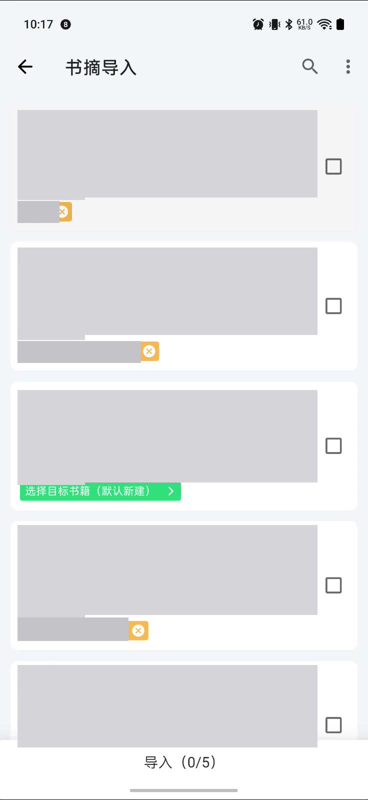
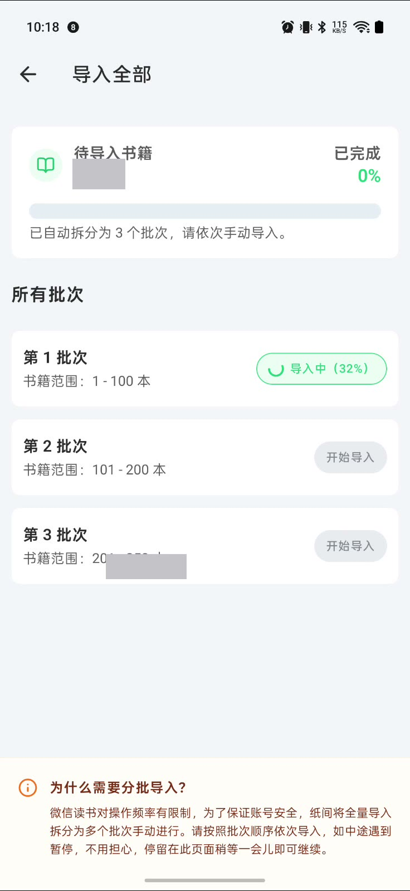
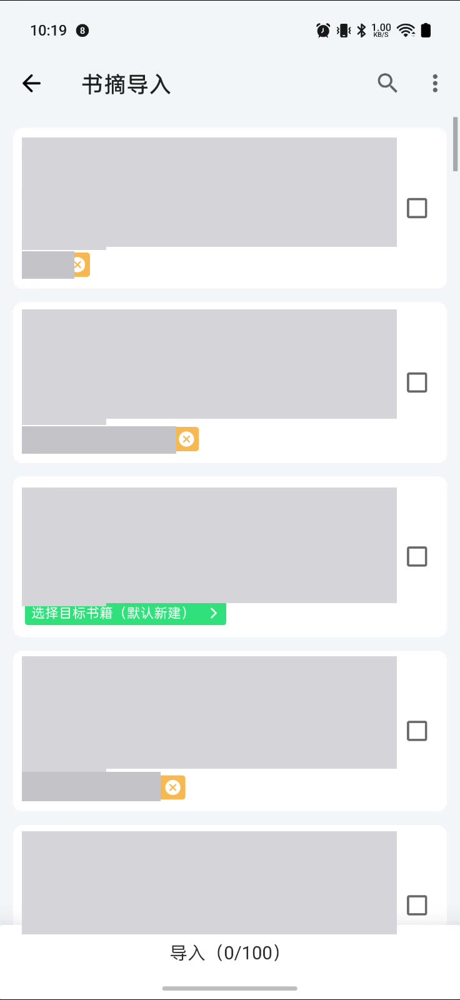
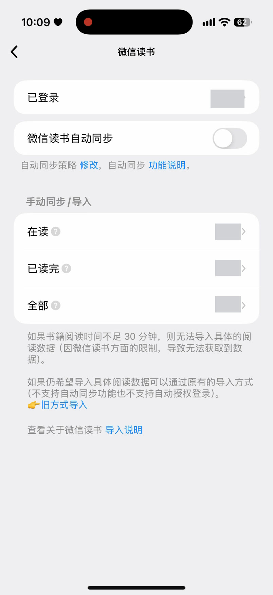
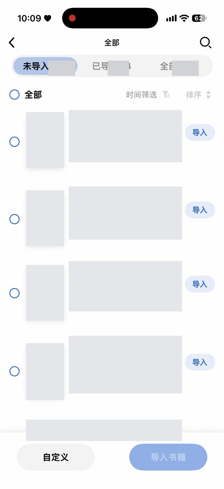
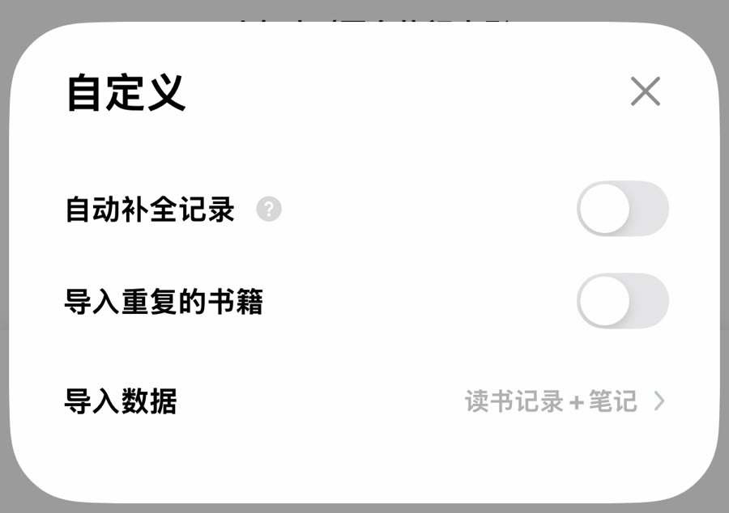
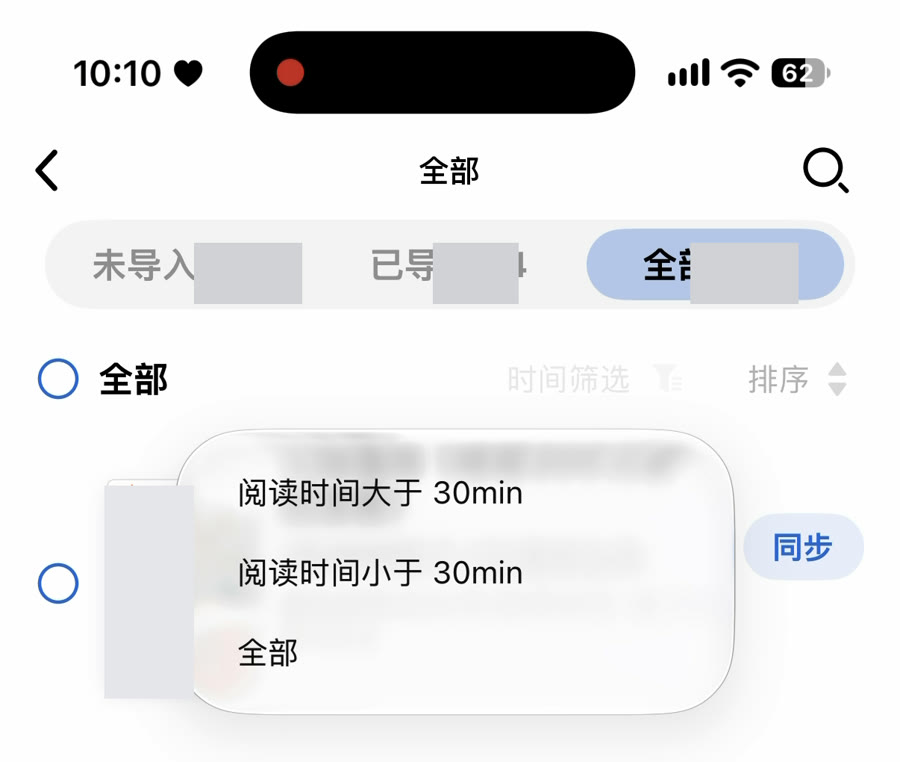

# 微信读书书摘导入体验优化：竞品对比与完整交互方案 v1.0

> 文档状态：产品研究与交互设计方案，不包含代码实现
> 研究日期：2026-09-04
> 研究对象：纸间书摘 Android 微信读书授权导入、竞品「阅读记录」微信读书导入、纸间书摘 iOS 当前实现
> 适用范围：微信读书授权导入，以及复用统一导入草稿模型的文件、剪贴板与 API 导入
> 截图说明：本文截图均由用户提供的录屏取证，并已遮挡账号、书名、作者、封面、个人数量与阅读历史；二维码和联系人画面未进入文档。

本文使用以下证据标签，避免把推断写成事实：

| 标签 | 含义 |
| --- | --- |
| `[录屏确认]` | 两段录屏中可直接观察到的页面、操作或结果 |
| `[Android 代码确认]` | Android 当前工作树中的真实调用、数据与写入逻辑 |
| `[iOS 代码确认]` | iOS 当前工作树中的真实调用、模型与写入逻辑 |
| `[产品决策]` | 本方案建议采用的目标交互或业务规则，尚未实现 |
| `[待验证]` | 录屏或源码不足以确认，需要原型、真机或实现阶段验证 |

结论摘要：

- `[录屏确认]` 两段录屏都没有展示实际写入和结果页，不能据此断言任一产品“没有”这些能力；只能判定相关阶段“录屏未证明”。
- `[Android 代码确认]` `[iOS 代码确认]` 纸间书摘在数据获取、目标书匹配、逐条书摘选择、重复检测、阅读时长和批量处理上已有较深的底层能力。
- `[录屏确认]` `[Android 代码确认]` 纸间书摘前台把“获取候选数据”和“写入本地数据”反复称为“导入”，批次成功也只代表详情获取成功，用户难以判断数据是否已经落库。
- `[录屏确认]` 竞品在来源限制说明、未导入/已导入分区、搜索、筛选、排序和导入选项上更成熟；但录屏没有证明书摘预览、逐条选择、最终写入、去重反馈和结果恢复是否完整。
- `[产品决策]` 目标流程应拆成“获取候选 → 选择书籍 → 按需获取详情 → 查看并选择内容 → 检查映射与冲突 → 最终确认 → 写入 → 结果与重试”，并由数据源能力决定可见字段和筛选项。

## 1. 功能背景与业务目标

### 1.1 功能背景

书摘导入不是一次普通的文件复制。用户需要把外部平台中的书籍身份、划线、想法、书评、章节、时间和阅读记录，安全地映射到纸间书摘已有的数据结构中。只要目标书匹配错误、重复判断不透明或写入结果不清楚，用户就会担心污染长期积累的阅读数据。

`[录屏确认]` 当前纸间书摘已经能从微信读书取得候选书，并提供书籍选择和目标书映射入口；当候选超过单批上限时，还会展示手动批次页。问题不在于“没有导入能力”，而在于用户无法稳定回答以下问题：

- 我现在只是在获取数据，还是已经在导入？
- 哪些书、哪些书摘会被写入？
- 它们会新建书籍，还是合并到已有书籍？
- 哪些内容会因为重复或冲突被跳过？
- 中途失败后，已经写入了什么，还需要重试什么？

### 1.2 产品目标

`[产品决策]` 本次设计以五个目标衡量：

1. **阶段清晰**：获取、检查和写入使用不同的页面状态与动词。
2. **范围可控**：用户可以精确选择书籍和书内内容，并随时看见选择范围。
3. **结果可信**：写入前可核对，写入后可追溯成功、跳过与失败项。
4. **来源适配**：界面只展示当前数据源真实支持、且当前数据有筛选价值的字段。
5. **可恢复**：授权过期、单书详情失败、部分写入、取消和重进都不要求用户从头开始。

### 1.3 业务价值

`[产品决策]` 预期业务价值不是单纯提升一次导入按钮的点击率，而是：

- 降低首次迁移门槛，让用户敢于先试一两本书。
- 提高大书库迁移完成率，减少人工分批与重复劳动。
- 降低错误合并、重复内容和假时间对长期数据的污染。
- 让微信读书、文件和剪贴板导入共享一致心智，降低后续新增来源的设计与维护成本。

### 1.4 本阶段范围外

- `[产品决策]` 不修改 Swift、Kotlin、数据库、解析器或公共 API。
- `[产品决策]` 不重新设计微信读书授权协议，也不承诺后台自动同步。
- `[产品决策]` 不将两个通用导入组件提升为全 App 公共组件；先归属于书摘导入业务域。
- `[待验证]` 不在本阶段确定视觉稿像素、动效曲线、埋点字段名和持久化草稿的清理期限。

## 2. 当前需要解决的问题及优先级

| 优先级 | 问题 | 当前证据 | 用户影响 | 本方案响应 |
| --- | --- | --- | --- | --- |
| P0 | 获取与写入语义混用 | `[录屏确认]` “开始导入”“导入全部”“导入中”既指获取详情，也指最终写入 | 用户无法判断数据是否已经落库，退出时也不知道会损失什么 | 获取阶段统一使用“获取”，仅最终确认页使用“开始导入” |
| P0 | 写入前没有完整清单 | `[录屏确认]` 两段录屏都未展示书籍、书摘、想法、书评、重复项与目标书汇总 | 错误只能在写入后发现 | 新增导入前检查页，阻断歧义映射并汇总冲突 |
| P0 | 写入结果与部分成功不透明 | `[Android 代码确认]` 整批没有外层事务；`[iOS 代码确认]` 当前按书提交，均可能出现部分落库 | 整体报错不等于零写入，盲目重试可能制造重复 | 结果页区分成功、跳过、失败；只重试失败项 |
| P1 | 大量候选书缺少有效筛选与明确选择范围 | `[录屏确认]` 纸间书摘只有搜索与完整列表全选；竞品提供状态、时长和排序入口 | 查找成本高，全选范围可能超出当前所见 | 动态筛选、排序与“全选当前结果”，保留被隐藏的已选项 |
| P1 | 书籍行承担过多动作 | `[录屏确认]` 编辑、目标书、清除映射、打开详情和勾选集中在一行 | 点击结果难预测，误操作成本高 | 勾选只选择；行主体只看内容；目标书独立入口 |
| P1 | 书摘详情缺少可发现的检查工具 | `[录屏确认]` 视频 1 未进入书摘详情；`[iOS 代码确认]` 当前仅列表与逐条勾选，无搜索、筛选、章节分组和展开规则 | 用户难以检查大书的真实导入内容 | 建立书摘查看与选择组件，按来源能力展示类型、章节和筛选 |
| P1 | 来源缺字段时仍可能出现无效控件 | `[Android 代码确认]` DTO 声明不等于实际映射；阅读时长也依赖设置与接口成功 | 空筛选、错误统计和伪精确信息损害信任 | 声明能力与实际数据质量双重门控 |
| P1 | 自动匹配、去重与时长冲突缺少解释 | `[Android 代码确认]` 同 ID/书名匹配、Hash 去重、手动时长优先均在后台处理 | 用户不知道为何合并或跳过 | 行内状态 + 导入前检查 + 结果原因三级反馈 |
| P2 | 授权依赖网页、二维码和跨 App 操作 | `[录屏确认]` 两个产品均出现网页/二维码路径，竞品还需微信、相册、网页与 App 切换 | 首次成功率和无障碍可用性受影响 | 保留授权恢复、非视觉说明、保存二维码与失败回退 |

## 3. 用户角色、任务与完整用户故事

### 3.1 核心用户角色

| 角色 | 典型上下文 | 最重要的成功标准 |
| --- | --- | --- |
| 试用导入者 | 第一次使用纸间书摘，只想验证一本书 | 少量步骤完成，写入前知道会发生什么 |
| 大书库迁移者 | 数百本书、来源限制明显 | 不手工管理技术批次，可暂停和继续 |
| 重复导入者 | 已导入过，近期只增加了少量书摘 | 不重复、不覆盖，不必重新检查全部内容 |
| 精细整理者 | 本地已有同名书、不同版本或自定义元数据 | 可以修正目标书，冲突不被静默处理 |
| 辅助功能用户 | 使用大字体、VoiceOver 或 Reduce Motion | 不依赖颜色、长按、细小控件或瞬时反馈完成流程 |

### 3.2 用户的核心任务

`[产品决策]` 用户真正要完成的任务是：“从一个可信来源找出我想迁移的阅读内容，确认它们将去往正确的本地书籍，再安全写入并得到可核对的结果。”

这意味着产品不能只优化“拿到候选列表”的速度，还必须覆盖选择、预览、映射、去重、写入和结果闭环。

### 3.3 用户故事与完成标准

| 用户故事 | 完成标准 |
| --- | --- |
| 作为首次用户，我只想导入一本书 | 来源只返回一本候选时自动选中；详情加载后默认选中全部可导入内容；用户仍需在最终确认页点击“开始导入” |
| 作为大书库用户，我想从大量候选中选择几本 | 搜索、筛选、排序都可用；多本候选默认不选；底栏始终显示已选书数；选择不会因筛选变化丢失 |
| 作为全量迁移用户，我的微信读书书库超过单批上限 | 系统自动分页获取；主流程不要求逐批点击；失败只标记受影响的书或页，并可继续其余内容 |
| 作为重复导入用户，我只想导入新增书摘 | 匹配已有目标书；精确重复默认不选并标为“将跳过”；最终确认和结果页显示新增与跳过数量 |
| 作为整理者，系统把书匹配错了 | “目标书”入口独立可见；可改为另一本、本次新建或暂不导入；歧义未解决时只阻止该书 |
| 作为精细导入用户，我只想导入一本书中的部分书摘或想法 | 可进入该书详情；原文与对应想法作为一个语义单元选择；选择结果返回书籍页并显示 `已选 N/M` |
| 作为跨来源用户，当前数据没有阅读时长、章节、状态或真实时间 | 不展示对应筛选、排序或统计；缺时间的内容不显示伪造日期，必要时标注“来源未提供” |
| 作为迁移用户，获取或写入过程中部分失败 | 已成功项保留；失败项有原因与单独重试；整体状态显示“部分完成”，不误报“失败且无写入” |
| 作为中断用户，我想稍后继续 | 返回时恢复候选、选择、映射和已完成书籍；重新授权后只补取缺失数据；不会重复写入已成功项 |
| 作为辅助功能用户，我要用大字体、VoiceOver 或 Reduce Motion 导入 | 所有主操作可读、可聚焦、命中区不少于 44pt；选择不只依赖颜色；页面可重排；非必要转场可减弱 |

## 4. 调研方法、证据边界与完成度评估标准

### 4.1 调研材料

- `[录屏确认]` 视频 1：`PKT110 2026-09-04 10.19.17.mp4`，102.41 秒，纸间书摘 Android 流程。
- `[录屏确认]` 视频 2：`ScreenRecording_09-04-2026 10-09-30_1.MP4`，53.06 秒，竞品「阅读记录」流程。
- `[Android 代码确认]` Android 工程：`/Users/wangke/Workspace/AndroidProjects/XMNote`。
- `[iOS 代码确认]` iOS 当前工作树中的授权导入、统一导入草稿、解析器注册、目标匹配与写入实现。
- `[产品决策]` iOS 交互约束来自 XMNote 当前设计系统及现有组件目录。

### 4.2 证据边界

- `[录屏确认]` “未展示”只表示本段录屏没有证明，不能直接推导为产品不存在该能力。
- `[Android 代码确认]` Android 代码用于确认纸间书摘的业务意图和真实数据链路，不代表 iOS 当前界面已经具备相同行为。
- `[iOS 代码确认]` 源码可以证明调用与数据结构，不能证明视觉可用性、点击命中区、动画、VoiceOver 或真机网络稳定性。
- `[待验证]` 竞品的筛选效果、排序规则、逐本“导入”行为、书摘详情、真实写入与结果处理，录屏均未完成操作。
- `[待验证]` 脱敏截图只能支撑信息结构和可见状态，不能单独证明色彩对比度或无障碍合规。

### 4.3 七阶段评估口径

| 阶段 | 完成定义 |
| --- | --- |
| 授权 | 用户完成身份校验，产品明确展示可继续的账号状态；过期时有恢复路径 |
| 获取 | 成功建立候选目录，进度、范围、限制和失败范围可理解 |
| 选择书籍 | 用户完成至少一本书的明确选择，且知道选择数量与目标书状态 |
| 查看书摘 | 用户查看书内真实内容，并能理解内容类型与选择范围 |
| 确认导入 | 写入前看见最终负载、目标书、重复项和冲突，并主动确认 |
| 执行写入 | 产品明确进入持久化阶段，并以真实写入进度反馈 |
| 查看结果 | 成功、跳过、失败均可核对，失败项可重试，结果可结束或回看 |

完成度使用三档：

- **已证明**：录屏实际完成该阶段的关键动作和可见结果。
- **部分证明**：只展示入口、部分状态或中间结果，没有完成关键动作。
- **未证明**：录屏未进入该阶段，或没有足够证据判断。

健康度另行标记为“健康 / 可用但有风险 / 高风险 / 阻断”，用于评估已展示体验，不把“未证明”等同于“产品缺失”。

### 4.4 操作成本口径

`[产品决策]` 本文不使用脱离任务上下文的纯点击数评分。操作成本结合以下因素判断：

- 是否需要跨 App、跨设备或离开主任务。
- 同一动作是否需要重复执行，例如手动逐批获取。
- 是否出现不可预测的自动跳转或阶段命名变化。
- 用户是否需要记住隐藏选择、批次状态和目标书状态。
- 失败后是否能从最近成功点继续。

## 5. 纸间书摘现状流程及优缺点

### 5.1 录屏路径还原

| 时间 | 页面与动作 | 可观察结果 |
| --- | --- | --- |
| 00:00–00:05 | 阅读首页 → 设置 → 书摘导入 → 微信读书授权导入 | `[录屏确认]` 来源按快捷、API、文件分组，入口说明明确 |
| 00:05–00:12.9 | 授权页加载微信读书网页；配置最近 5 本、阅读时长、仅含笔记；点击“开始导入” | `[录屏确认]` 用户以为开始导入，实际随后只获取候选与详情 |
| 00:13–00:20.8 | “书籍获取中” → 5 本候选列表 | `[录屏确认]` 行内展示书籍信息、摘录数、目标书状态与勾选框；没有实际勾选 |
| 00:20.8–00:30.5 | 打开编辑书籍、目标书搜索、候选搜索和更多菜单 | `[录屏确认]` 入口存在，但均未完成变更；全选藏在更多菜单 |
| 00:30.5–00:47 | 返回授权页、刷新、短暂未登录、出现二维码，再回到候选列表 | `[录屏确认]` 能恢复到列表，但扫码成功动作与成功提示未被录屏清楚证明 |
| 00:48–00:52 | 导入范围改为“全部”，再次“开始导入” | `[录屏确认]` 进入“导入全部”批次页 |
| 00:52–00:74.3 | 系统拆成 3 批，手动启动第 1 批 | `[录屏确认]` 进度从 0% 到完成，其他批次暂时禁用；总体进度在末尾跳变 |
| 00:74.3–01:42.4 | 自动进入首批 100 本候选列表 | `[录屏确认]` 无任何书被勾选；视频结束时仍为 `导入（0/100）` |

### 5.2 录屏证据

*视频 1 · 00:07.2｜`[录屏确认]` 授权页同时承载第三方网页与导入范围设置，主按钮使用“开始导入”。*

*视频 1 · 00:15.5｜`[录屏确认]` 列表提供勾选、目标书和搜索入口；本次录屏仍为 0/5。*

*视频 1 · 01:00.0｜`[录屏确认]` 技术批次直接暴露给用户，批次按钮写“导入中”，而此时尚未选择书籍或写入。*

*视频 1 · 01:41.0｜`[录屏确认]` 视频结束时底部为 `导入（0/100）`，没有进入真实写入。*

### 5.3 Android 真实链路

`[Android 代码确认]` 当前 Android owner 链路为：

`WeReadImportAuthActivity`（授权与设置）→ `WeReadImportAuthPresenter`（候选分流）→ `WeReadRepository`（目录与详情）→ `BookRepository.fillTargetImportBook`（目标书匹配）→ `ImportActivity`（书籍/书摘选择）→ `ImportPresenter`（过滤选中项）→ `NoteRepository.importNotesToDbRx`（真实写入）。

`[Android 代码确认]` 关键事实：

- 候选来自“有笔记的书”或整个书架，可限制为全部或最近 5/10/20/30/60/100 本。
- 候选数大于 100 时按 100 本拆批；批次 `Success` 在进入预览前就设置，只表示详情已获取。
- 单本详情包含划线、想法/书评、章节；阅读信息只在设置允许或书已读完等条件下请求。
- 自动匹配优先精确微信读书 ID，再尝试精确原书名，并防止同名异 ID 或多个来源 ID 抢占同一本地书。
- 多本书和书摘默认不选，只有单本候选首次进入时自动全选；书评当前随书导入，不支持逐条选择。
- 真正写库只发生在通用预览页点击底部“导入”之后。
- 书摘按“目标书 + 内容 Hash”去重；Hash 只包含规范化后的原文和想法，不含章节、位置、时间或微信读书范围。
- 目标书存在手动阅读记录时，会整本跳过微信读书阅读时长。
- 来源缺少创建时间时，Android 当前会替换成当前时间，之后无法区分真实时间与补值。
- 整批没有外层事务；出现后续错误时，之前的独立写入不一定回滚。

### 5.4 优点

- `[录屏确认]` 来源入口分组清楚，微信读书授权导入的用途与范围配置容易找到。
- `[录屏确认]` 支持先取最近少量书试用，也支持全量；可以选择是否读取阅读时长及是否只获取有笔记的书。
- `[录屏确认]` 候选行已有封面、阅读状态、书名、作者、摘录数、目标书和选择反馈等关键基础信息。
- `[录屏确认]` 已提供候选搜索、全选、目标书搜索、默认新建与新书元数据编辑入口。
- `[Android 代码确认]` 底层对书籍详情、逐条书摘、书评、章节、阅读时长、目标匹配和重复内容已有较完整处理。
- `[Android 代码确认]` 匹配具备 ID 优先与同名冲突保护，不是简单地把所有同名书静默合并。

### 5.5 缺点与风险

阻断问题：

- `[录屏确认]` 没有展示进入书内查看真实书摘，也没有最终负载检查、实际写入和结果页。
- `[Android 代码确认]` `[录屏确认]` 批次成功与真正写入脱节，却使用“导入中/已完成”等写入语义。

高风险问题：

- `[录屏确认]` “开始导入”“导入全部”“批次导入中”“导入（0/100）”分别指向不同阶段，心智不稳定。
- `[录屏确认]` 技术批次要求用户逐批启动，首批完成后还自动离开批次页；录屏未证明如何继续余下批次并保持选择。
- `[录屏确认]` 行点击、目标标签、删除映射、目标书入口与勾选框密集并置，动作归属不清。
- `[Android 代码确认]` 完整列表全选不受当前搜索结果约束，用户可能选择未看见的书。
- `[Android 代码确认]` 单书详情错误在不同路径有不同粒度：直达流程可能提示跳过但仍保留原书，批次流程可能整批失败。
- `[Android 代码确认]` 缺失时间被替换为当前时间，会制造看似精确但来源不真实的数据。
- `[Android 代码确认]` 整体报错可能发生在部分数据已经写入之后，但当前没有逐书结果摘要。

中风险问题：

- `[录屏确认]` 第三方网页占据大面积空间，包含与导入任务无关的搜索、热搜和阅读导航。
- `[录屏确认]` 搜索与全选发现性一般；零选择时底部禁用状态的语义不够强。
- `[待验证]` 小图标、标签关闭按钮、勾选框的真实命中区和 VoiceOver 顺序需要真机验证。

## 6. 「阅读记录」现状流程及优缺点

### 6.1 录屏路径还原

| 时间 | 页面与动作 | 可观察结果 |
| --- | --- | --- |
| 00:00–00:10 | 授权弹层 → 微信 → 相册/扫码入口 → 返回授权弹层 | `[录屏确认]` 路径依赖跨 App 操作；包含二维码，未进入本文截图 |
| 00:10–00:16 | 微信读书网页确认登录 | `[录屏确认]` 页面最终显示“登录成功” |
| 00:16–00:19.2 | 返回竞品微信读书来源页 | `[录屏确认]` 展示已登录、自动同步、手动同步/导入分区、来源限制和帮助入口 |
| 00:19.2–00:26.3 | 打开书籍列表 | `[录屏确认]` 展示未导入、已导入、全部三个范围，以及搜索、时间筛选、排序、全选、逐本操作和批量底栏 |
| 00:26.3–00:33.8 | 打开“自定义” | `[录屏确认]` 展示自动补全记录、导入重复书籍、导入数据范围等选项 |
| 00:40 左右 | 打开外部使用说明 | `[录屏确认]` 离开 App 后页面在录屏中未形成可用内容；不能据此判断长期可用性 |
| 00:49.2–00:53.1 | 打开阅读时长筛选并停留在书籍列表 | `[录屏确认]` 选项为大于 30 分钟、小于 30 分钟、全部；未实际选择书籍或进入后续阶段 |

### 6.2 录屏证据

*视频 2 · 00:19.2｜`[录屏确认]` 来源页解释了自动同步、手动导入和阅读时长限制。*

*视频 2 · 00:26.3｜`[录屏确认]` 列表区分未导入、已导入、全部，并同时提供逐本动作与批量选择。*

*视频 2 · 00:33.8｜`[录屏确认]` 自定义设置在选择页 Sheet 中集中展示。*

*视频 2 · 00:49.2｜`[录屏确认]` 30 分钟阈值是微信读书来源的可见示例，不应成为通用组件规则。*

### 6.3 优点

- `[录屏确认]` 来源概览把登录状态、自动同步、手动入口、来源限制和帮助放在同一上下文中。
- `[录屏确认]` 候选页明确区分“未导入 / 已导入 / 全部”，用户可以围绕增量任务缩小范围。
- `[录屏确认]` 搜索、时间筛选、排序、全选、单书操作和批量操作均直接可见，处理大列表的工具完整度更高。
- `[录屏确认]` 自定义选项提前暴露重复书籍和导入数据范围，体现了对冲突策略的关注。
- `[录屏确认]` 直接说明低于 30 分钟时受微信读书限制，避免把来源缺数据误认为 App 故障。

### 6.4 缺点与风险

阻断性证据缺口：

- `[录屏确认]` 没有实际选择书籍、进入书摘详情、最终确认、真实写入或结果页。
- `[待验证]` “导入数据：读书记录 + 笔记”是否允许查看或细选具体笔记，录屏不能确认。

高风险问题：

- `[录屏确认]` 授权涉及 App、微信、相册/扫码、网页和 App 切换，步骤多且依赖视觉二维码。
- `[录屏确认]` 行左侧选择圆圈与右侧“导入/同步”按钮并存，单书立即执行与批量选择的边界不清楚。
- `[录屏确认]` “导入重复的书籍”把书籍身份冲突压缩成开关，用户仍不知道会新建、合并还是覆盖。
- `[录屏确认]` 来源页的“在读 + 已读完”与“全部”数量在录屏中不构成直观等式，分类口径需要额外解释；个人数量已在截图中脱敏。
- `[录屏确认]` 使用说明跳转到外部页面，离开当前任务；录屏中的页面没有成功承载帮助内容。

中风险问题：

- `[录屏确认]` 30 分钟被固定成二元阈值，适合解释微信读书限制，但未证明对其他数据源是否动态适配。
- `[待验证]` 浅灰文案、禁用按钮、图标命中区、VoiceOver 标签和大字体布局需要真机验证。
- `[待验证]` “自动补全记录”具体补什么、是否会生成推测数据、用户能否在写入前复核，录屏没有解释。

### 6.5 可借鉴但不能直接照搬的设计

| 借鉴点 | 采用方式 | 不直接照搬的原因 |
| --- | --- | --- |
| 来源限制说明 | 在来源摘要和相关筛选旁解释数据限制 | 说明应来自数据源能力，不固化为微信读书专属文案 |
| 未导入/已导入范围 | 转化为“导入处理状态”筛选，并显示数量 | 需要区分已匹配、已全部重复、曾导入但有新增内容等真实状态 |
| 搜索、筛选、排序 | 作为书籍选择组件的首要工具 | 必须按字段可用性动态出现 |
| 自定义导入选项 | 把影响写入的策略放在确认前可见位置 | 不把高风险映射/覆盖简化为一个无解释开关 |
| 逐本快速动作 | 可提供“只处理这一本”的快捷路径 | 仍应进入最小确认，不允许绕过内容与目标书核对 |

## 7. 双方逐阶段对比表与综合结论

### 7.1 七阶段完成度

| 阶段 | 纸间书摘 | 「阅读记录」 | 对比判断 |
| --- | --- | --- | --- |
| 授权 | **部分证明 / 可用但高风险**：初始可用，刷新后出现未登录与二维码，随后恢复；扫码成功动作未被清楚记录 | **已证明 / 可用但高成本**：跨 App 完成网页登录并显示成功 | 竞品完成证据更完整；两者都需要降低二维码与跨 App 负担 |
| 获取 | **部分证明 / 高风险**：最近 5 本完成；全量只完成首批，技术批次暴露 | **部分证明 / 风险未知**：来源计数和列表已出现，但同步过程、分页和错误未展示 | 纸间书摘证明了真实抓取过程，但前台批次设计负担更高 |
| 选择书籍 | **部分证明 / 高风险**：列表、搜索、全选、映射存在，录屏未选择 | **部分证明 / 可用性较好但动作有歧义**：状态、筛选、排序、单书/批量动作存在，录屏未选择 | 竞品候选管理更成熟；纸间书摘目标书能力更深 |
| 查看书摘 | **未证明**：录屏没有进入书内；源码证明存在逐条书摘选择 | **未证明**：录屏没有进入书内 | 两者录屏均无法验证真实内容检查体验 |
| 确认导入 | **未证明 / 当前结构不足**：只有底部导入计数，没有最终负载摘要 | **未证明**：展示自定义选项，但未展示最终书籍、内容与冲突汇总 | 竞品有策略入口，双方都未证明完整 preflight |
| 执行写入 | **未证明**：结束时仍为 0 选择；源码证明写入触发点 | **未证明** | 不能根据录屏比较写入可靠性 |
| 查看结果 | **未证明**：当前 iOS/Android 前台均缺少逐书结果摘要证据 | **未证明** | 结果闭环是双方录屏共同空白 |

### 7.2 综合结论

`[录屏确认]` `[Android 代码确认]` `[iOS 代码确认]` 纸间书摘的优势位于“数据层和业务规则”：它能获取较丰富的书籍详情，支持目标书映射、逐条书摘选择、去重、书评、阅读时长与批量处理。其短板位于“阶段表达和用户控制”：前台把获取和写入混在一起，在选择、确认、异常和结果阶段缺少足够反馈。

`[录屏确认]` 竞品的优势位于“候选管理和来源解释”：未导入状态、搜索、筛选、排序、自定义策略和来源限制更容易发现。其完成度上限仍不能由本段录屏证明，因为关键的书摘查看、最终确认、写入和结果均未出现。

`[产品决策]` 最优方向不是复制竞品整页，而是把竞品的“来源透明 + 候选管理”与纸间书摘已有的“数据深度 + 映射 + 去重”组合成一条完整且可恢复的导入路径。

## 8. 不同导入源的数据能力矩阵

### 8.1 当前统一草稿可承载的数据

`[iOS 代码确认]` `NoteImportDraftBook` 已能承载书籍元数据、阅读状态与位置、微信读书标识与更新时间、分组/标签、书摘、章节、书评、精确/模糊阅读时长等；`NoteImportDraftNote` 可承载原文、想法、位置、可选时间、微信读书范围/章节、标签和附件。

`[iOS 代码确认]` 统一模型“能承载”某字段，不代表每个解析器“能提供”该字段，也不代表候选目录阶段已经取得该字段。页面不得从统一模型字段的存在反推控件可用。

### 8.2 能力矩阵

说明：**稳定**表示当前解析/适配链路有直接字段；**条件**表示依赖版本、内容、用户设置或接口补全；**无**表示当前证据未见可靠输出。该表用于产品门控，不代表永久协议承诺。

| 来源族 | 多书候选 | 阅读状态/更新 | 章节 | 书摘 + 想法 | 书评 | 真实内容时间 | 逐书阅读时长 | 分组/标签 | 产品提示 |
| --- | --- | --- | --- | --- | --- | --- | --- | --- | --- |
| 微信读书授权 | 稳定 | 稳定 | 条件 | 稳定 | 稳定 | 条件 | 条件 | 无 | 目录轻量获取；详情与时长按需补全 |
| 微信读书剪贴板旧版/8.3 前后 | 通常单书 | 无 | 条件 | 稳定 | 无 | 条件 | 无 | 无 | 不展示阅读状态、时长或书评筛选 |
| Kindle My Clippings | 稳定 | 无 | 无 | 稳定 | 无 | 条件 | 无 | 无 | 可按位置和可靠时间筛选，不假设章节 |
| Apple Books 导出 | 稳定 | 无 | 无 | 稳定 | 无 | 条件 | 无 | 无 | 仅在实际存在修改时间时展示时间筛选 |
| 掌阅 EPUB | 单书 | 无 | 稳定 | 稳定 | 无 | 无 | 无 | 无 | 位置/章节可用，时间明确显示“来源未提供” |
| Reeden 等结构化来源 | 条件 | 条件 | 稳定 | 稳定 | 条件 | 稳定 | 条件 | 条件 | 以当前文件实际字段和值分布为准 |
| API / 桌面端统一草稿 | 条件 | 条件 | 条件 | 条件 | 条件 | 条件 | 条件 | 条件 | 能力最宽，但必须校验本次 payload，而非默认全开 |

### 8.3 动态适配规则

`[产品决策]` 控件出现必须同时满足“数据源声明支持”和“本次数据可靠且有区分价值”：

1. 来源不支持、解析不可靠或本次全为空：隐藏对应筛选、排序和统计。
2. 字段只有一个取值，筛选不会缩小结果：隐藏筛选，但可作为只读元数据展示。
3. 部分记录缺值：保留筛选，增加“未知（N）”；未知值不强行塞进任一时间或状态区间。
4. 能力已知但仍在补全：控件位置保持稳定并暂时禁用，显示“正在补全数据”；补全失败后移除无效选项并解释。
5. “能导入总阅读时长”和“候选列表有逐书阅读时长”分别判断；前者不能自动开启后者的筛选和排序。
6. 阅读时长不可获取时，不展示阅读时长筛选、排序、统计或空占位。
7. 竞品的 30 分钟只作为微信读书来源限制的示例阈值；通用组件不内置 `30min`。
8. 页面不得使用 `if sourceName == ...` 决定控件。数据源适配层提供能力、可靠性、选项和说明文案。

### 8.4 产品级来源能力对象

`[产品决策]` 后续实现应由数据源适配层提供以下产品语义，而非让页面猜测：

- 候选目录可用字段：书名、作者、封面、状态、更新时间、书摘数量、逐书时长、分组/标签。
- 详情可用内容：划线、想法、书评、章节、位置、时间、附件、阅读记录。
- 详情获取策略：无需补全、按书补全、可批量补全、授权后补全。
- 可靠性：完整、部分缺失、来源推测、不可用。
- 选择策略：单书/多书、默认可选内容、书评独立/随书/只读。
- 来源限制：分页上限、频率限制、时间阈值、授权过期与可重试方式。

## 9. 完整导入流程与页面状态机

### 9.1 推荐完整路径

`[产品决策]`

### 9.2 为什么先取轻量目录

`[iOS 代码确认]` 当前微信读书链路在展示候选前会为全部候选拉取书摘、章节、书评和可选阅读时长；大量候选会放大等待、失败和频率限制。

`[产品决策]` 新流程先用书籍 ID、书名、作者、封面、状态、更新时间等轻量字段建立候选目录。只有用户打开某本书或准备继续已选书时，才获取该书详情。这样可以：

- 更快进入可操作列表。
- 避免为最终不会选择的书请求详情。
- 把失败范围收缩到单书，并允许其余书继续。
- 让系统在后台按优先级预取已选书，而不暴露技术批次。

### 9.3 页面地图

| 页面 | 形态 | 唯一主任务 | 主操作 |
| --- | --- | --- | --- |
| 来源选择 | 页面 | 选择导入来源 | 进入来源 |
| 授权/提供数据 | 页面 | 建立可读取来源 | 获取候选书籍 |
| 书籍选择 | 页面 | 确定要处理的书 | 下一步（已选 N 本） |
| 书摘查看 | 页面导航 | 检查并选择一本书的内容 | 确认本书（已选 N 条） |
| 目标书选择 | Sheet | 修改一本书的本地目标 | 使用此书 / 新建书籍 |
| 筛选与排序 | Sheet | 调整当前结果范围 | 应用 |
| 导入前检查 | 页面 | 核对最终负载与冲突 | 开始导入 |
| 写入进度 | 页面 | 观察持久化进度或取消 | 无持续主按钮；提供“停止导入”次级动作 |
| 结果 | 页面 | 理解结果并处理失败 | 完成；部分成功时主操作为“重试失败项” |

### 9.4 状态机

| 内部阶段 | 用户可见标题/状态 | 可执行操作 | 退出与恢复 |
| --- | --- | --- | --- |
| `idle` | 选择来源 | 选择来源 | 无草稿 |
| `authorizing` | 正在授权 | 取消、查看说明 | 取消回来源页 |
| `loadingCatalog` | 正在获取候选书籍 | 停止获取 | 已获得的完整分页可暂存 |
| `catalogReady` | 选择要导入的书籍 | 搜索、筛选、选择、看详情、改目标书 | 自动保存选择草稿 |
| `loadingDetails` | 正在获取所选书内容 | 查看已就绪书、重试单书、停止获取 | 保留已就绪详情与选择 |
| `reviewingContent` | 查看书摘 | 搜索、筛选、展开、选择 | 返回自动保存本书选择 |
| `preflight` | 检查导入内容 | 修正映射、查看重复项、确认 | 未解决歧义只阻止受影响书 |
| `writing` | 正在导入 | 查看逐书进度、停止导入 | 每本完成后写入检查点 |
| `cancelling` | 正在安全停止 | 等待当前原子单元结束 | 不开始下一本 |
| `partialSuccess` | 部分完成 | 重试失败项、查看详情、完成 | 已成功项不会重复写入 |
| `success` | 导入完成 | 查看已导入书籍、完成 | 清理本次草稿 |
| `failure` | 未能开始/继续导入 | 重试、返回调整 | 若已有写入，必须转为“部分完成”而非整体失败 |
| `cancelled` | 已停止导入 | 继续未完成项、完成 | 保留已成功项与剩余清单 |

### 9.5 分页与技术批次

- `[产品决策]` 超过来源单批限制时，系统自动分页，不展示“第 1/2/3 批”作为主流程。
- `[产品决策]` 用户只看见“已获取 N/M 本”或“正在获取更多书籍”，必要时在来源说明中解释频率限制。
- `[产品决策]` 某一页失败时，保留已经获得的候选并显示“还有 N 本未获取”；可重试缺失页，不清空选择。
- `[产品决策]` 只有诊断详情需要显示技术页码/批次 ID，普通用户不承担调度责任。

## 10. 通用书籍选择组件详细设计

### 10.1 组件定位

`[产品决策]` 组件暂命名为“导入候选书籍选择器”，归属 `书摘导入` 业务域，供微信读书授权、文件、剪贴板与 API 导入共同使用。只有在至少两个独立业务域证明相同根因和交互契约后，才考虑提升为全局组件。

组件负责选择和浏览，不负责网络、解析、数据库写入或匹配算法。业务 owner 将候选、能力、状态和命令注入组件。

### 10.2 产品级组件契约

输入：

- 候选书：稳定来源 ID、可见元数据、内容计数、导入可用性。
- 来源能力：可搜索字段、筛选项、排序项、限制说明、详情加载策略。
- 目标书状态：新建、已匹配、需确认、不可导入。
- 选择草稿：已选书 ID、书内部分选择摘要、被筛选隐藏的已选项。
- 加载状态：目录分页、元数据补全、单书详情、局部错误。

输出：

- 选中的书 ID 集合。
- 当前搜索、筛选、排序和可见结果范围。
- 查看某本书内容的意图。
- 修改某本书目标书的意图。
- 继续到详情补全/导入前检查的意图。

### 10.3 页面结构

| 区域 | 内容 | 交互规则 |
| --- | --- | --- |
| 导航栏 | 返回、标题“选择书籍” | 返回时自动保存草稿；存在进行中获取时询问“停止获取” |
| 来源摘要 | 来源名、获取时间、候选总数、已完成范围、数据限制 | 可折叠查看说明；不显示账号敏感凭据 |
| 搜索 | 书名、作者；来源支持时扩展分组、标签 | 使用 `XMInlineSearchField`；滚动时立即收起键盘 |
| 筛选/排序条 | 动态筛选 chips、排序入口、当前结果数 | 使用 `XMScopeSelector`；只有能力成立且有区分价值时出现 |
| 隐藏选择提示 | “另有 N 本已选书不在当前结果中” | 提供“查看已选”快捷筛选，不自动取消 |
| 书籍列表 | 封面、书名、作者、可用元数据、内容数量、目标书状态、选择状态 | 点击主体看书摘；勾选只选择；目标书为独立按钮 |
| 固定底栏 | 已选数量、全选当前结果、清空选择、下一步 | 主按钮为 `下一步（已选 N 本）`，N=0 时禁用并有无障碍原因 |

### 10.4 书籍行语义

`[产品决策]` 一行拆成三个明确动作：

1. **选择指示器**：只切换该书是否纳入本次导入。
2. **书籍主体**：只进入书摘查看页，不同时改选择或打开编辑。
3. **目标书入口**：显示“新建书籍 / 已匹配：… / 需要确认 / 不可导入”，点击后打开目标书 Sheet。

不使用长按承载编辑或映射等主要能力。长按可以作为系统上下文菜单补充，但不得是唯一入口。

行内状态：

- **新建**：未找到可信目标，默认创建新书；用户可改为已有书。
- **已匹配**：高置信唯一匹配；可在导入前修改。
- **需确认**：候选有歧义或仅书名命中；该书可查看，但不能进入最终写入。
- **不可导入**：没有任何可写入数据、来源详情持续失败或格式不支持；选择器禁用，行主体仍可进入查看原因。

### 10.5 默认选择规则

- `[产品决策]` 来源实际只返回 **1 本候选** 时，自动选中该书；详情就绪后自动选中全部可导入、非重复内容。
- `[产品决策]` 来源返回 **多本候选** 时，默认全部不选，批量导入必须由用户明确选择。
- `[产品决策]` 多本候选经过搜索或筛选只剩 1 本时，不触发自动选中；自动规则只看原始候选规模。
- `[产品决策]` 勾选一本书默认选择其所有可导入、非重复内容及“随书导入”数据；用户进入详情取消部分内容后，行显示 `已选 N/M`。
- `[产品决策]` 若书籍只有阅读记录、书评或元数据可导入而没有书摘，行必须明确显示实际负载，不以“0 条书摘”误判为不可导入。

### 10.6 搜索、筛选与排序

搜索：

- 书名、作者为基础字段。
- ISBN 只用于目标书搜索，不假设所有来源候选都有可靠 ISBN。
- 分组/标签只有来源提供且本次有值时纳入搜索。
- 搜索不改变选择，仅改变当前结果范围。

动态筛选候选：

- 导入处理状态：新建、已匹配、需确认、无新增内容。
- 阅读状态：在读、读完、未读、未知。
- 更新时间：由可靠更新时间生成范围，缺值进入“未知”。
- 阅读时长：仅逐书值可靠时出现，阈值由来源适配层提供。
- 内容数量：有可导入内容、无新增内容，或有价值的数量区间。
- 分组/标签：仅实际存在多个值时出现。

动态排序候选：

- 来源默认顺序。
- 最近阅读、最近更新、书摘数量、书名。
- 字段缺失或所有值相同则不显示该排序项。

### 10.7 全选、筛选与隐藏选中项

- `[产品决策]` “全选当前结果（N）”只作用于当前搜索和筛选结果，不选择被隐藏的书。
- `[产品决策]` 清空选择默认清空全部已选书，并用二次轻确认明确范围；若只清当前结果，按钮必须写“取消选择当前 N 本”。
- `[产品决策]` 改变筛选后保留既有选择，并显示“另有 N 本已选书不在当前结果中”。
- `[产品决策]` 进入“查看已选”后仍可返回此前查询条件。
- `[产品决策]` 选择计数以完整草稿为准，不以当前可见列表为准。

### 10.8 加载与性能

- `[产品决策]` 候选目录先显示可用行；封面、计数和详情可以渐进补全。
- `[产品决策]` 用户打开某书时优先加载该书；勾选后加入详情预取队列。
- `[产品决策]` 点击“下一步”时，若仍有详情未就绪，进入“正在获取所选书内容”，展示逐书状态；不退回整页加载。
- `[产品决策]` 已有列表刷新失败使用 `XMInlineStatusBanner`，首次目录失败使用 `XMContentStateView`。

## 11. 通用书摘查看与选择组件详细设计

### 11.1 组件定位与契约

`[产品决策]` 组件暂命名为“导入内容查看器”，同样归属书摘导入业务域。

输入：

- 书籍摘要与目标书状态。
- 内容集合：书摘、想法、书评、章节、位置、时间、重复与冲突标记。
- 内容能力：可用类型、可用搜索字段、分组方式、书评写入策略。
- 选择草稿与默认选择策略。
- 加载、分页、错误和补全状态。

输出：

- 选中的内容稳定 ID 集合。
- 目标书修改意图。
- 单书详情重试请求。
- 本书确认、返回或跳过结果。

### 11.2 页面结构

| 区域 | 内容 | 规则 |
| --- | --- | --- |
| 书籍摘要 | 封面、书名、作者、目标书状态、总内容数 | 目标书入口独立；摘要可折叠但状态持续可见 |
| 类型切换 | 书摘、想法、书评 | 只展示来源实际拥有的类型；原文与对应想法仍作为一个语义单元 |
| 搜索 | 原文、想法、章节标题 | 只搜索来源提供的文本，不搜索隐私敏感的本地目标内容 |
| 筛选/排序 | 新增/重复/冲突、时间、章节、来源顺序 | 按能力动态出现；缺真实时间不提供时间筛选 |
| 内容列表 | 章节分组或连续列表 | 有可靠章节时分组；否则不制造“未分类章节”层级 |
| 固定底栏 | 已选 N/M、全选当前结果、确认本书 | `确认本书（已选 N 条）`；返回也自动保存，不强迫额外保存 |

### 11.3 原文与想法的语义单元

- `[Android 代码确认]` `[iOS 代码确认]` 当前导入模型将原文和想法共同参与内容 Hash，业务上已存在紧密关系。
- `[产品决策]` 一条原文及其对应想法默认作为一个选择单元，共同选择、共同取消，避免导入孤立想法或丢失上下文。
- `[产品决策]` 行摘要显示原文、想法标识、章节/位置和可靠时间；点击主体展开完整内容，再次点击收起。
- `[产品决策]` 勾选控件只负责选择，点击主体只负责展开；不把长按作为查看全文或选择的必要入口。
- `[待验证]` 如果后续确认同一原文可挂多个独立想法，需要扩展为“原文组 + 子想法”结构，而不是在当前方案中假定一对一。

### 11.4 内容类型与书评策略

`[产品决策]` 书评采用来源能力指定的三种策略：

| 策略 | 界面 | 适用条件 |
| --- | --- | --- |
| 独立选择 | 每条书评有选择器，可全选当前结果 | 数据源与写入层支持独立稳定 ID 和逐条写入 |
| 随书导入 | 只读展示，标注“随书导入” | 当前微信读书 Android/iOS 行为：选择书后书评整体进入写入 |
| 仅供参考 | 只读展示，标注“不写入” | 来源可展示但当前写入模型不支持 |

页面不能只因为类型名为“书评”就硬编码交互。

### 11.5 选择规则

- `[产品决策]` 选中书籍时，默认选中该书所有可导入、非重复内容；精确重复默认不选。
- `[产品决策]` “全选当前结果（N）”只选择当前类型、搜索和筛选结果，不触及隐藏内容。
- `[产品决策]` 一部分内容被选中时，书籍页显示部分选择状态与 `N/M`，不只用颜色表达。
- `[产品决策]` 取消全部内容后，如果该书仍有被选择的阅读时长、书评或元数据，书籍仍可保持纳入状态，并明确显示实际负载；若完全无负载则自动取消整本并解释。
- `[产品决策]` 从详情返回不会丢弃选择；选择草稿立即保存。

### 11.6 章节、时间与位置

- `[产品决策]` 有可靠章节树时按章节分组，并支持折叠和“本章全选当前结果”。
- `[产品决策]` 无章节时使用连续列表，不用“未知章节”给所有内容增加无意义层级。
- `[产品决策]` 有可靠页码/位置时展示；不同来源单位保留来源语义，不强行换算。
- `[产品决策]` 缺失的真实时间不展示成导入时刻。必要时显示“来源未提供时间”，并将“获取时间”只放在来源摘要中。
- `[产品决策]` 时间只有部分缺失时，时间筛选提供“未知（N）”，排序时未知项固定在末尾且不伪造值。

### 11.7 详情错误

- `[产品决策]` 单书详情首次失败，在该书详情页使用整页错误状态，并提供“重试本书”和“暂不导入此书”。
- `[产品决策]` 已经展示部分内容后补全失败，使用行内提示，保留当前内容与选择。
- `[产品决策]` 章节获取失败但书摘可用时，降级为连续列表；提示“章节未能获取”，不丢弃书摘。

## 12. 目标书匹配、重复内容和冲突处理

### 12.1 当前匹配事实

- `[Android 代码确认]` 自动匹配优先精确微信读书 ID，再尝试精确原书名；本地已有不同微信读书 ID 时不接受同名匹配，同一候选集合也避免多个来源 ID 占用同一本地书。
- `[iOS 代码确认]` 当前 iOS 同样优先微信读书 ID，再以原始书名匹配尚无微信读书 ID 且未被本批占用的本地书。
- `[产品决策]` 这些 ID 保护必须保留；书名命中不能直接等价为高置信匹配。

### 12.2 推荐匹配层级

| 优先级 | 条件 | 默认结果 | 是否需要用户确认 |
| --- | --- | --- | --- |
| 1 | 来源稳定书 ID 与本地来源 ID 精确一致 | 已匹配 | 否，但允许修改 |
| 2 | 唯一、可靠 ISBN 精确一致，且无来源 ID 冲突 | 已匹配 | `[待验证]` 实现前验证各来源 ISBN 质量；低质量来源降级为需确认 |
| 3 | 规范化书名 + 作者唯一一致，且本地无冲突 ID | 建议匹配 | 是，首次显示“需确认” |
| 4 | 仅书名一致、存在多个版本或作者缺失 | 候选列表 | 是，必须选择 |
| 5 | 无可信候选 | 新建书籍 | 否，但允许选择已有书 |

`[产品决策]` 未解决的歧义只阻止该书进入最终写入；其他书可以继续。用户的人工选择在本次草稿中优先于自动匹配，刷新数据时不被覆盖。

### 12.3 目标书 Sheet

使用 `XMSheetScaffold`，包含：

- 当前来源书摘要。
- 当前目标与匹配依据，例如“微信读书 ID 一致”“书名相同，需确认”。
- 搜索本地书：书名、作者、ISBN。
- 结果行：封面、书名、作者、已有来源标识冲突提示。
- 固定操作：`使用此书`；以及 `新建书籍`。

选择“新建书籍”后可以在导入前编辑来源提供的书名、作者和 ISBN。已匹配本地书的信息不在导入流程中被来源元数据静默覆盖；若来源有差异，仅作为只读对照或后续独立编辑建议。

### 12.4 当前去重事实与风险

- `[Android 代码确认]` `[iOS 代码确认]` 书摘当前按“目标书 + 内容 Hash”去重，核心 Hash 基于规范化的原文与想法。
- `[Android 代码确认]` `[iOS 代码确认]` 章节、位置、来源范围和时间不进入核心文本 Hash；相同文本出现在不同位置时可能被视为重复。
- `[Android 代码确认]` `[iOS 代码确认]` 书评使用标题与正文的规范化组合去重。
- `[Android 代码确认]` `[iOS 代码确认]` 当前重复通常被静默跳过，前台没有完整的预计跳过与结果原因。

### 12.5 推荐冲突分类

| 类型 | 判断 | 默认处理 | 用户反馈 |
| --- | --- | --- | --- |
| 精确重复 | 稳定来源内容 ID 一致；或同目标书下原文 + 想法 Hash 一致 | 跳过，不选中 | “重复，将跳过” |
| 同原文、想法不同 | 原文一致但想法发生变化 | 标为冲突，不静默覆盖 | 选择“保留本地”或“作为新增导入”；批量默认保留本地 |
| 同文本、位置不同 | 文本相同但可靠来源位置/范围不同 | 优先视为不同记录 | 显示位置差异；无位置时降级为可能重复 |
| 目标书歧义 | 多个本地候选或来源 ID 冲突 | 阻止该书 | “需要确认目标书” |
| 阅读时长冲突 | 本地已有手动记录，或同日存在来源记录 | 保留手动记录；只填补无冲突的可靠日期 | 确认页显示将跳过的时长与原因 |
| 来源时间缺失 | 原记录没有可靠时间 | 保持未知 | 不显示伪造日期；可显示“来源未提供” |

`[产品决策]` 首版不提供一个笼统的“导入重复内容”开关。书籍身份、精确重复、想法差异和位置差异是不同风险，必须分别处理。

### 12.6 导入前检查页

`[产品决策]` 最终确认必须展示：

- 已选书籍 N 本。
- 将新建 N 本、合并 N 本、仍需确认 N 本。
- 将导入书摘 N 条、想法 N 条、书评 N 条、阅读记录 N 条。
- 预计跳过精确重复 N 条。
- 发生内容冲突 N 条、阅读时长冲突 N 本、来源时间未知 N 条。
- 详情获取失败或不可导入 N 本。

按书折叠展示明细。点击任一数字进入对应筛选结果。所有阻断项解决后，页面唯一主按钮才可用，文案为“开始导入”。

## 13. 加载、失败、取消、重试及部分成功

### 13.1 错误处理矩阵

| 场景 | 页面反馈 | 数据保留 | 恢复动作 |
| --- | --- | --- | --- |
| 首次授权失败 | 授权页整页错误 | 不建立候选 | 重试授权、查看帮助、改用其他来源 |
| 授权过期 | 行内或整页“登录已过期” | 保留已获取目录、选择与映射 | 重新授权后只补取缺失/过期详情 |
| 首次目录失败 | `XMContentStateView` | 保留来源设置 | 重试获取、返回改范围 |
| 目录已有内容，继续分页失败 | `XMInlineStatusBanner` | 保留已有候选与选择 | 仅重试未完成分页 |
| 单书详情失败 | 书行状态 + 详情错误页 | 保留其他书详情 | 重试本书、暂不导入此书 |
| 章节失败但内容成功 | 行内降级说明 | 保留书摘 | 使用连续列表、单独重试章节 |
| 目标书歧义 | 书行“需确认” | 保留内容与选择 | 修改目标书；该书暂不进入写入 |
| 写入单书失败 | 写入进度中标记失败并继续安全项 | 已完成书保持落库 | 结果页仅重试失败项 |
| App 被系统中断 | 下次打开恢复草稿与检查点 | 已完成书和未完成列表都保留 | 继续未完成项或结束 |

### 13.2 退出与取消文案

- `[产品决策]` 授权/获取阶段退出：标题“停止获取候选书籍？”，说明已获取结果是否保留。
- `[产品决策]` 选择/检查阶段返回：自动保存草稿，不弹出无意义确认；明确提供“放弃本次导入”。
- `[产品决策]` 写入阶段退出：标题“停止导入？”，说明“当前正在写入的书完成后停止；已完成内容会保留”。
- `[产品决策]` 不使用不区分阶段的“取消任务”“退出导入”。

### 13.3 写入原子性与进度

`[Android 代码确认]` Android 当前只有单条书摘去重与写入的局部事务，没有整批或整书外层事务。`[iOS 代码确认]` iOS 当前以单本书的数据库写操作为主要提交边界，因此一场会话可能部分完成。

`[产品决策]` 产品层采用“逐书检查点”口径：

- 进度只统计真实持久化完成的书，不统计候选获取完成。
- 每本书结束后记录 `成功 / 跳过 / 失败` 和稳定幂等键。
- 停止导入时不启动下一本；当前原子单元安全结束后进入已取消/部分完成。
- 重新进入时先核对检查点和重复状态，已成功书不重复写入。
- 如果实现仍可能在一本书内部部分写入，结果明细必须降到内容类别或记录级，不能虚报整书成功。

### 13.4 结果页

结果页顶部只出现三种总状态：

- **导入完成**：所有可执行项已经成功或按预期跳过。
- **部分完成**：至少一项成功，同时存在失败、取消或未解决项。
- **未能导入**：没有任何写入成功，且写入未开始或全部失败。

结果摘要：

- 成功：书籍、书摘、想法、书评、阅读记录。
- 跳过：精确重复、无新增内容、手动时长优先、用户取消。
- 失败：按书展示可理解原因，不直接暴露原始异常。
- 操作：`重试失败项`、`返回调整`、`查看已导入书籍`、`完成`。

`[产品决策]` 重试只包含失败或未完成项，并再次运行匹配和去重，保证幂等。成功只代表数据已完成持久化，不代表“已获取”或“进入预览”。

### 13.5 中断恢复草稿

`[产品决策]` 草稿至少保存：来源类型、候选稳定 ID、获取完成范围、选择、目标书人工修改、内容选择、冲突决策和逐书写入检查点。授权 Cookie、二维码和书摘正文不重复写入普通偏好存储；凭据沿用既有安全会话，内容遵守现有数据库保护。

`[待验证]` 草稿自动清理期限、跨版本兼容和多次并行导入限制需要在实现设计阶段确定。首版产品只允许一个活动导入草稿；开始新任务时明确询问继续或放弃旧草稿。

## 14. 文案、无障碍与设计系统约束

### 14.1 统一文案词典

| 阶段 | 推荐文案 | 禁止混用 |
| --- | --- | --- |
| 建立候选 | 获取候选书籍 / 正在获取书籍 / 数据已就绪 | 正在导入、导入完成 |
| 选择 | 选择书籍 / 查看书摘 / 下一步（已选 N 本） | 开始导入 |
| 检查 | 检查导入内容 / 需要确认目标书 / 将跳过 N 条重复内容 | 同步完成 |
| 写入 | 开始导入 / 正在导入 / 正在安全停止 | 获取中、批次成功 |
| 结果 | 导入完成 / 部分完成 / 未能导入 / 跳过 / 重试失败项 | 统一使用“失败”掩盖部分成功 |

文案必须带对象，例如“全选当前 23 本”“取消选择全部 5 本”“停止获取候选书籍”，不使用脱离范围的“全部”“取消”“完成”。

### 14.2 设计系统组件

`[产品决策]` 后续实现优先复用：

| 需求 | 组件 |
| --- | --- |
| 书籍封面 | `XMBookCover` |
| 选择状态 | `XMSelectionIndicator` |
| 类型/范围切换 | `XMScopeSelector` |
| 行内搜索 | `XMInlineSearchField` |
| 目标书与筛选 Sheet | `XMSheetScaffold` |
| 首次空态/错误/加载 | `XMContentStateView` |
| 已有内容下的局部错误和提示 | `XMInlineStatusBanner` |
| 高风险中止确认 | `XMSystemAlert` 或系统 Alert 语义 |

主流程和书摘详情使用页面导航；筛选、排序和目标书选择使用 Sheet；高风险停止写入使用 Alert。每屏只保留一个主操作。

### 14.3 无障碍

- `[产品决策]` 所有可点击区域不少于 44×44pt；视觉图标可以更小，但命中区必须满足要求。
- `[产品决策]` 选择状态同时使用图形、文字和无障碍值，例如“已选择，已选 12/20 条”，不只依赖颜色。
- `[产品决策]` 书籍行的 VoiceOver 焦点顺序为：书籍身份与内容摘要 → 选择状态 → 目标书状态 → 查看内容；独立动作不合并成不可预测的整行按钮。
- `[产品决策]` Dynamic Type 下，书名、作者、计数和目标书状态纵向重排；不固定卡片高度，不截断主操作。
- `[产品决策]` 搜索结果滚动时立即收起键盘；返回页面恢复焦点到先前书籍行。
- `[产品决策]` 获取与写入进度提供可访问的数值和阶段描述，不只播放动画；进度跳变时发布恰当公告，避免逐百分比打扰。
- `[产品决策]` Reduce Motion 下使用淡入淡出或即时状态替代自动滑动、庆祝粒子和非必要缩放；自动转页改为用户确认或可预测导航。
- `[产品决策]` 二维码授权提供文字步骤、保存二维码、重新生成和可用替代路径说明；二维码不进入日志、埋点或截图资产。

### 14.4 隐私与安全

- `[产品决策]` 埋点不记录书名、作者、书摘原文、想法、二维码、Cookie、联系人或本地目标书名。
- `[产品决策]` 可记录来源类型、候选数量区间、阶段、耗时、错误分类和匿名数量。
- `[产品决策]` 截图/客服日志默认遮挡个人书库；导出诊断前明确说明范围。

## 15. 数据指标与验收场景

### 15.1 核心指标

| 指标 | 定义 | 诊断价值 |
| --- | --- | --- |
| 授权成功率 | 进入授权后成功建立可读取会话的比例 | 识别二维码和跨 App 流失 |
| 候选目录成功率 | 发起获取后至少获得一页有效候选的比例 | 区分授权问题与目录问题 |
| 候选首屏耗时 | 点击“获取候选书籍”到可操作列表的 P50/P90 | 验证轻量目录是否改善等待 |
| 选择到检查转化 | 到达书籍选择页后进入导入前检查的比例 | 识别筛选、选择和映射阻力 |
| 目标书人工修正率 | 自动建议后被用户改动的书占比 | 衡量匹配可信度，不记录书名 |
| 内容精细选择率 | 进入书内并修改默认内容选择的书占比 | 衡量详情组件价值 |
| 导入完成率 | 开始真实写入后到达完成或部分完成且无待重试项的比例 | 衡量写入闭环 |
| 部分成功率 | 有成功也有失败/取消的会话占比 | 暴露真实可靠性，不被整体失败掩盖 |
| 失败项重试成功率 | 结果页发起仅重试后成功的比例 | 衡量恢复设计 |
| 重复跳过率 | 预检或写入中判为精确重复的内容占比 | 识别重复导入场景与去重质量 |
| 分阶段退出率 | 授权、获取、选书、看内容、检查、写入各阶段退出比例 | 精确定位流程断点 |

### 15.2 埋点原则

- 事件中的 `phase` 必须区分 `fetch` 与 `write`。
- 进度统计以稳定匿名 ID 和数量为单位，不上传内容。
- 匹配只记录置信类别与是否人工修正，不记录来源书名或目标书 ID 原值。
- 失败记录归一化分类：授权、网络、限流、解析、详情、映射、数据库、取消、未知。

### 15.3 验收场景

1. **单本默认选择**：给定来源只返回 1 本书；当目录就绪；则该书自动选中，详情就绪后所有非重复可导入内容默认选中，但仍需最终确认。
2. **多本默认不选**：给定来源返回 2 本及以上；当目录就绪；则没有书被自动选中，主按钮显示禁用的 `下一步（已选 0 本）`。
3. **筛选不触发自动选择**：给定多本候选；当筛选后只剩 1 本；则该书仍不自动选中。
4. **全选当前结果**：给定 100 本候选、筛选后 12 本可见；当用户选择“全选当前结果（12）”；则只新增这 12 本，其他 88 本不被选择。
5. **隐藏选择保留**：给定已选 5 本；当筛选隐藏其中 3 本；则底栏仍显示已选 5 本，并提示“另有 3 本不在当前结果中”。
6. **超过单批上限**：给定来源候选超过 100 本；当用户获取目录；则系统自动分页并显示总体获取进度，不要求用户逐批点击。
7. **错误目标匹配**：给定书名相同但来源 ID 冲突；当自动匹配；则该书标为“需确认”，不覆盖已有 ID，也不进入最终写入。
8. **部分书摘选择**：给定一本书有 20 个语义单元；当用户在详情页只选 6 个；则书籍行显示 `已选 6/20`，最终确认只计算这 6 个。
9. **原文与想法成组**：给定原文有对应想法；当勾选或取消；则两者作为一个语义单元共同变化，并在汇总中分别统计书摘与想法数量。
10. **无阅读时长**：给定来源声明不支持或本次没有可靠逐书时长；当打开书籍选择；则不出现阅读时长筛选、排序或统计。
11. **部分时间缺失**：给定部分内容有真实时间、部分没有；当使用时间筛选；则存在“未知（N）”，无时间记录不显示导入时刻。
12. **重复导入**：给定目标书已有完全相同原文与想法；当预检；则对应内容默认不选并显示“重复，将跳过”，结果页计入跳过数。
13. **手动时长冲突**：给定目标书已有手动阅读记录；当预检微信读书时长；则默认保留手动记录，明确显示被跳过或可安全填补的日期范围。
14. **单书详情失败**：给定 5 本已选书中 1 本详情失败；当其余详情完成；则用户可继续检查其他 4 本，并单独重试或跳过失败书。
15. **写入部分失败**：给定前 3 本成功、第 4 本失败；当写入结束；则结果为“部分完成”，前 3 本保留，只提供重试失败与未完成项。
16. **停止导入**：给定正在写入；当用户确认停止；则当前原子单元安全结束后不再开始下一本，结果列出成功、未完成与取消项。
17. **授权过期恢复**：给定目录和选择已完成但授权过期；当重新授权；则候选、选择和人工映射保留，只补取失效详情。
18. **辅助功能**：给定最大辅助字号、VoiceOver 和 Reduce Motion；当完整导入一书；则所有关键动作可聚焦、标签明确、布局不遮挡，且无需长按或颜色识别。

## 16. 录屏证据与源码证据附录

### 16.1 录屏关键节点

纸间书摘：

| 时间 | 证据 |
| --- | --- |
| 00:06.5–00:12.9 | 来源配置与“开始导入” |
| 00:13.0–00:15.0 | 书籍获取中 |
| 00:15.5 | 5 本候选列表 |
| 00:20.8–00:30.5 | 编辑、映射、搜索、全选入口 |
| 00:52.0 | 超过上限后拆成 3 批 |
| 01:00.0 | 首批详情获取进度 |
| 01:41.0 | 仍为 `导入（0/100）`，没有真实写入 |

「阅读记录」：

| 时间 | 证据 |
| --- | --- |
| 00:10–00:16 | 微信读书网页登录并显示成功 |
| 00:19.2 | 来源概览、自动同步与限制说明 |
| 00:26.3 | 未导入/已导入/全部列表及候选工具 |
| 00:33.8 | 自定义导入选项 |
| 00:49.2 | 阅读时长大于/小于 30 分钟筛选 |
| 00:53.1 | 停留在列表，没有选择、详情、写入或结果 |

### 16.2 Android 源码证据

Android 工作树核对版本：`b7f0bc35c772b3de1e2035a745d586fff523b3a4`。部分文件存在与本研究无关的本地改动，因此行号以核对时工作树为准。

| 结论 | 文件与行号 |
| --- | --- |
| 授权成功后进入获取入口，不直接写库 | `app/src/main/java/com/merpyzf/xmnote/ui/data/activity/import_note/weread/WeReadImportAuthActivity.kt:529-565, 639-675` |
| 范围与字段设置 | `WeReadImportAuthActivity.kt:97-106, 234-269` |
| 候选取 notebook 或 shelf，并按 recent count 截取 | `data/src/main/java/com/merpyzf/data/repository/WeReadRepository.kt:213-233, 651-683` |
| 只有候选数大于 100 才进入批次 | `app/src/main/java/com/merpyzf/xmnote/mvp/presenter/data/WeReadImportAuthPresenter.kt:47-80`；`common/src/main/java/com/merpyzf/common/constant/AppConstant.java:29` |
| 每批 100；批次 Success 只代表详情就绪 | `app/src/main/java/com/merpyzf/xmnote/viewmodel/data/WeReadBatchImportViewModel.kt:49-72, 93-132`；`WeReadBatchImportActivity.kt:178-189` |
| 详情包含书摘、想法/书评、章节及条件性阅读信息 | `WeReadRepository.kt:575-644, 701-754`；`common/src/main/java/com/merpyzf/common/model/http/WeReadWebService.kt:69-121` |
| DTO 中的进度/分类当前未全部映射到候选 Book | `common/src/main/java/com/merpyzf/common/model/dto/weread_web/SyncBookDto.kt:12-76`；`WeReadRepository.kt:686-699, 799-817` |
| 匹配优先 WeRead ID，再匹配名称并保护 ID 冲突 | `data/src/main/java/com/merpyzf/data/repository/BookRepository.kt:3593-3654`；`data/src/main/java/com/merpyzf/data/dao/BookDao.kt:327-337` |
| 单本自动全选，多本默认不选；书摘可逐条选择 | `common/src/main/java/com/merpyzf/common/model/vo/Book.kt:78, 358-411`；`Note.kt:28`；`ImportBookListFragment.kt:96-124`；`ImportNoteListFragment.kt:92-122` |
| 全选作用于完整源列表，不是当前搜索结果 | `app/src/main/java/com/merpyzf/xmnote/mvp/presenter/data/ImportBookListPresenter.kt:43-69` |
| 书评当前随书导入，无逐条选择 | `ImportNoteListFragment.kt:281-285`；`data/src/main/java/com/merpyzf/data/repository/NoteRepository.kt:269-301` |
| 真正写库在 ImportActivity 点击“导入”之后 | `ImportActivity.kt:66-82, 100-104`；`ImportPresenter.kt:43-70`；`NoteRepository.kt:168-213` |
| 书摘去重为目标书 + content/idea Hash | `NoteRepository.kt:701-755`；`data/src/main/java/com/merpyzf/data/entity/NoteImportHashEntity.kt:7-18`；`data/src/main/java/com/merpyzf/data/helper/NoteContentHashHelper.kt:7-25, 58-80` |
| 书评按规范化标题和正文去重 | `NoteRepository.kt:462-504`；`data/src/main/java/com/merpyzf/data/dao/ReviewDao.kt:114-115` |
| 有手动记录时整本跳过微信读书时长 | `NoteRepository.kt:507-543`；`data/src/main/java/com/merpyzf/data/dao/ReadTimeRecordDao.kt:682-686` |
| 缺失来源时间被替换为当前时间 | `WeReadRepository.kt:1401-1455`；`NoteRepository.kt:269-278` |
| 没有覆盖整批/整书的外层事务，可能部分落库 | `NoteRepository.kt:168-174, 181-302, 715-753`；`ImportPresenter.kt:67-70` |

### 16.3 iOS 源码证据

| 结论 | 文件与行号 |
| --- | --- |
| 微信读书授权设置支持最近数量、阅读时长和仅含笔记 | `xmnote/Domain/Models/WereadImportModels.swift:10-21`；`xmnote/Views/Personal/DataImport/DataImportView.swift:81-213` |
| 当前“开始导入”实际先取 ID 和完整详情 | `xmnote/ViewModels/Personal/WereadImportViewModels.swift:98-140` |
| 目录元数据来自 syncBooks，详情再取书摘、想法/书评、章节与可选阅读信息 | `xmnote/Data/Repositories/WereadImportRepository.swift:615-712` |
| 详情当前在用户选择前批量获取 | `WereadImportRepository.swift:187-279` |
| 自动匹配优先 WeRead ID，再匹配没有 WeRead ID 的同名本地书 | `WereadImportRepository.swift:282-299` |
| 单本候选自动选择，多本默认不选；当前搜索仅书名/作者 | `xmnote/ViewModels/Personal/WereadImportViewModels.swift:279-308` |
| 当前全选作用于完整列表，不限定当前筛选结果 | `WereadImportViewModels.swift:295-301`；`xmnote/Views/Personal/DataImport/UnifiedNoteImportViews.swift:256-260` |
| 候选页直接提交并关闭，没有独立 preflight 和结果页 | `xmnote/Views/Personal/DataImport/DataImportView.swift:283-324`；`UnifiedNoteImportViews.swift:298-339` |
| 书摘页有逐条选择，书评为“随书导入”；缺搜索/筛选/章节分组 | `DataImportView.swift:416-457`；`UnifiedNoteImportViews.swift:476-518` |
| 统一草稿承载书籍、书摘、章节、书评、时长、标签和附件 | `xmnote/Domain/Models/NoteImportModels.swift:105-179` |
| 生产解析器注册覆盖多种文件与剪贴板来源 | `xmnote/Data/Import/NoteImportParserRegistry.swift:59-86` |
| 授权/API 适配器提供不同宽度的数据能力 | `xmnote/Data/Import/NoteImportDraftAdapters.swift:10-121` |
| 写入按书执行数据库事务，会话可部分完成 | `xmnote/Data/Repositories/NoteImportRepository.swift:151-199` |
| 书摘 Hash 主要基于原文与想法，位置与时间不参与 | `xmnote/Data/Import/NoteImportContentHash.swift:11-60`；`NoteImportRepository.swift:765-840` |
| 有手动阅读记录时跳过该书的微信读书时长 | `NoteImportRepository.swift:1007-1047` |
| 微信读书缺少远端时间时当前会补“现在” | `WereadImportRepository.swift:635-664` |

### 16.4 iOS 解析器来源清单

`[iOS 代码确认]` 当前注册表包含以下生产来源标识：

`booxOld`、`booxNew`、`doubanRead`、`dedao`、`dangdang`、`dimo`、`wereadOld`、`wereadPre830`、`weread830`、`duokan`、`ireaderSelected`、`moonReader`、`doubanApp`、`reader163`、`fanqie`、`readingo`、`kindleApp`、`koreader`、`legado`、`neatReader`、`koodo`、`reeden`、`kindle`、`jdReader`、`ireaderFile`、`ireaderEpub`、`appleBooks`、`hanwang`。

该清单只证明解析器注册存在；每个来源的字段质量仍需由能力适配层与本次 payload 共同决定。

### 16.5 截图资产清单

| 文件 | 来源 | 时间 | 脱敏范围 |
| --- | --- | --- | --- |
| `xmnote-01-source-options.jpg` | 视频 1 | 00:07.2 | 第三方网页热搜 |
| `xmnote-02-book-selection.jpg` | 视频 1 | 00:15.5 | 封面、书名、作者、内容数量、目标书名 |
| `xmnote-03-manual-batch-progress.jpg` | 视频 1 | 01:00.0 | 个人书库总量与末批数量 |
| `xmnote-04-recording-ended-zero-selected.jpg` | 视频 1 | 01:41.0 | 封面、书名、作者、内容数量、目标书名 |
| `reading-record-01-source-summary.jpg` | 视频 2 | 00:19.2 | 账号名与个人数量 |
| `reading-record-02-unimported-books.jpg` | 视频 2 | 00:26.3 | 个人数量、封面、书名、作者、日期、时长 |
| `reading-record-03-custom-options.jpg` | 视频 2 | 00:33.8 | 裁切为设置 Sheet，不含背景个人内容 |
| `reading-record-04-reading-time-filter.jpg` | 视频 2 | 00:49.2 | 个人数量与可见书籍内容 |

### 16.6 待验证清单

- `[待验证]` 竞品是否存在书摘详情、逐条选择、最终确认、实际写入、去重说明、结果页和失败重试。
- `[待验证]` 竞品的搜索字段、筛选实际效果、排序规则、“同步/导入”差异和 30 分钟阈值来源。
- `[待验证]` 纸间书摘现有书摘详情在大数据量、章节缺失、部分时间缺失和书评场景下的真机表现。
- `[待验证]` 各解析器的字段能力声明、实际空值率和稳定 ID 质量，需要实现阶段逐源建立契约测试样本。
- `[待验证]` 大字体、VoiceOver、键盘、Reduce Motion、颜色对比度与 44pt 命中区，需要原型和真机验收。
- `[待验证]` 中断恢复草稿的保留期限、安全存储、跨版本迁移与清理策略。

### 16.7 决策记录

| 决策 | 理由 |
| --- | --- |
| 获取与写入使用不同动词 | 这是当前最核心的心智断点，也是批次状态误解的根因 |
| 多本候选默认不选 | 批量写入是高影响动作，必须由用户明确授权范围 |
| 单本候选自动选中 | 保留低负担试用路径，同时仍有最终确认兜底 |
| 技术批次自动化 | 来源限制属于系统调度责任，不应转嫁给用户 |
| 书籍选择与书摘查看分为两个通用业务组件 | 两个任务信息密度和操作语义不同，但需共享来源能力与选择草稿 |
| 筛选由能力与数据共同门控 | 统一模型字段存在不等于当前来源/本次数据可用 |
| 原文与想法默认成组 | 保持语义上下文，也符合现有 Hash 的核心数据组合 |
| 不显示伪造来源时间 | “未知”比错误的精确时间更可信 |
| 写入按部分成功设计 | 双端当前实现都不能把整体错误安全等价为零写入 |
| 首版不提供笼统“导入重复”开关 | 书籍身份、内容重复与冲突需要不同决策 |
