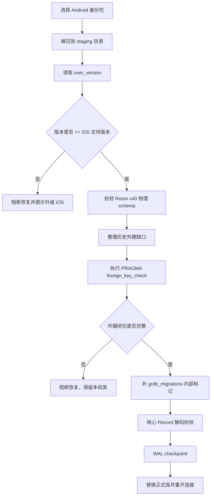

# 跨端数据库同步 - 设计文档

## 1. 背景
XMNote 同时存在 Android 与 iOS 客户端，用户会通过备份恢复和后续同步能力在两端迁移同一份阅读数据。数据库是整个应用的核心事实源，跨端能力不能只保证“业务查询看起来能用”，还必须保证数据库文件能被 Android Room 与 iOS GRDB 框架安全打开、识别和继续写入。

当前设计以 Android Room v40 为物理 schema 事实源。iOS 端不再手写一套独立 SQLite 表结构，而是通过 Android Room 导出的 schema JSON 创建和校验数据库。这样可以把跨端互通的判断从“代码实现是否相似”收敛为“同一份 SQLite 文件是否满足同一份 Room schema 合同”。

本文档中的“跨端同步”分为两个层次：
- 当前已实现的整库备份/恢复互通：Android 备份可恢复到 iOS，iOS 备份可恢复到 Android。
- 后续可演进的记录级同步：在同一物理 schema 和数据语义合同下，再定义逐记录合并与冲突解决。

## 2. 设计目标
- Android Room schema JSON 是唯一物理结构合同。
- iOS 新库由 Room canonical schema 创建，保证导出的数据库能被 Android Room 识别。
- Android 备份恢复到 iOS 前必须进入 staging 库，完成版本、schema、外键闭包和核心 Record 解码校验。
- iOS 备份恢复到 Android 时，必须保留 Room `identityHash`、SQLite `user_version`、实体表、索引、外键和 nullable 语义。
- 版本不兼容时阻断跨端恢复，本机数据继续可用。
- 恢复失败时不得替换正式库，原始备份包不得被修改。

## 3. 非目标
- 本阶段不实现记录级同步冲突合并。
- 本阶段不做数据库自动降级。
- 本阶段不兼容旧 iOS 开发期 schema 或半初始化库。
- 本阶段不新增 v41，不修改 Android Room 代码。
- 本阶段不把外键校验失败提示为“数据损坏”。

## 4. 核心术语
| 术语 | 含义 |
| --- | --- |
| Room schema JSON | Android Room 导出的数据库结构 JSON，当前为 `RoomSchemaV40.json`。 |
| `user_version` | SQLite 数据库结构版本，当前与 Android `DBConfig.DB_VERSION=40` 对齐。 |
| `room_master_table` | Android Room 内部身份表，用 `identityHash` 快速识别 schema。 |
| canonical schema | iOS 按 Room schema JSON 创建出的标准物理结构。 |
| staging 库 | 恢复备份时解压出的临时数据库副本，只在正式替换前使用。 |
| GRDB migration 标记 | iOS 内部 `grdb_migrations` 表，只用于避免 GRDB 重复执行建表和 seed。 |
| tombstone 父行 | 为满足外键闭包创建的软删除父记录，只用于结构完整性，不进入业务 UI。 |

## 5. Database 分层设计
当前 iOS Database 包按职责分为五层。

| 分层 | 代码位置 | 职责 |
| --- | --- | --- |
| Core | `xmnote/Database/Core` | 打开数据库、配置 WAL、执行 GRDB migration、补 Room canonical 库的 iOS 内部迁移标记。 |
| SchemaContract | `xmnote/Database/SchemaContract` | 加载 Room schema JSON，创建 Room canonical 表、索引、`room_master_table`，校验物理 schema 并输出结构差异诊断。 |
| Seed | `xmnote/Database/Seed` | 写入 Android 对齐的默认用户、来源、阅读状态、默认书、默认章节和初始化配置。 |
| Records | `xmnote/Database/Records` | 一表一 Record，负责 snake_case 映射和 Android nullable 字段的 iOS 解码兼容。 |
| RestoreCompatibility | `xmnote/Database/RestoreCompatibility` | 备份 staging 校验、外键闭包整理、默认根记录补齐和 tombstone 父行创建。 |

`xmnote/Services/BackupService.swift` 只负责备份包 I/O、解压、版本读取、正式替换和回滚；它不直接理解 Room schema 细节。恢复前的数据库结构与数据整理统一交给 `BackupSchemaValidator.prepareForRestore`。

## 6. 物理 schema 合同

### 6.1 Android 是事实源
当前事实源为：
- Android Room schema JSON：`xmnote/Database/SchemaContract/RoomSchemaV40.json`
- 数据库版本：`40`
- Room `identityHash`：`104ccc4da4aae1203a5850535d772d84`
- Room 实体表数量：35 张

iOS 端不得再用手写 GRDB table builder 作为物理 schema 真相源。所有业务表、索引、外键、nullable 都以 Room JSON 为准。

### 6.2 iOS 新库创建
iOS 首次创建数据库时，由 `RoomCanonicalSchemaV40.createAllTables` 执行：
1. 读取 `RoomSchemaV40.json`。
2. 按 JSON 中的 `createSql` 创建 35 张 Room 实体表。
3. 按 JSON 中的索引定义创建索引。
4. 写入 `room_master_table(id=42, identity_hash=104ccc4da4aae1203a5850535d772d84)`。
5. 写入 `PRAGMA user_version = 40`。
6. 执行 `Seed` 写入 Android 对齐的默认数据。

这条路径不重放 Android 历史 migration，也不保留旧 iOS schema 补丁。原因是当前产品尚未正式上线，iOS 可以直接从 Room v40 canonical schema 起步。

### 6.3 iOS 打开已有库
普通 App 打开链路只做本机数据库打开与物理结构识别：
1. `AppDatabase` 创建 `DatabasePool`。
2. 配置 WAL。
3. 如果数据库已是 Room v40 且缺少 `grdb_migrations`，调用 `markRoomCanonicalMigrationsIfNeeded`。
4. `markRoomCanonicalMigrationsIfNeeded` 只允许校验物理 schema，并补 iOS 内部 migration 标记。
5. 普通打开链路不执行 `foreign_key_check` 修复，不创建 tombstone，不整理备份历史脏关系。

这样可以避免把“恢复外部备份”中的整理策略带入“打开本机库”的生命周期。

### 6.4 额外内部表
iOS 可以拥有 `grdb_migrations` 这类内部表。Android Room 的 schema validation 关注 Room 实体表、索引、外键和 `room_master_table`，额外内部表不应影响 Android 打开数据库。

## 7. 双向备份恢复流程

### 7.1 Android → iOS
Android 备份恢复到 iOS 时必须先进入 staging 副本，流程如下：

关键约束：
- `BackupSchemaValidator.prepareForRestore` 是恢复前唯一安全闸门。
- `RoomCanonicalSchemaV40.validatePhysicalSchema` 只校验物理结构，不修复数据。
- `StagingIntegrityCanonicalizer` 只在 staging 库运行，不修改正式库和原始备份包。
- `DefaultRootSeeder` 先补齐 `user.id=1`、`source.id=0`、`read_status`、`book.id=0`、`chapter.id=0`。
- `TombstoneFactory` 只为缺失父记录创建最小合法软删除父行。
- 失去父级的活跃子记录只软删除，不硬删。

### 7.2 iOS → Android
iOS 备份恢复到 Android 时，iOS 导出的数据库必须保持以下条件：
- `PRAGMA user_version = 40`。
- `room_master_table` 中 `id=42` 的 `identity_hash` 为 Room v40 hash。
- 35 张 Room 实体表、字段、索引、外键与 Room JSON 一致。
- Android nullable 文本列保持 nullable，不通过 iOS 私有默认值改变表结构。
- `grdb_migrations` 等 iOS 内部表可存在，但不得影响 Room 实体表结构。
- 备份包中至少包含 `xm_note.db`；如存在 WAL/SHM，应与主库一致。

Android 端恢复时应先做版本与 Room schema 校验，再替换正式库。若发现高版本备份或 schema 不一致，应阻断恢复并保留 Android 本机库。

## 8. 数据语义合同

### 8.1 软删除
`is_deleted` 是跨端软删除语义。所有业务查询都应以 Android 对齐的过滤口径排除软删除记录。恢复整理过程中遇到孤儿活跃子记录时，只允许将其标记为 `is_deleted = 1`，不得硬删用户数据。

### 8.2 tombstone 父行
tombstone 父行用于修复历史备份中的外键闭包缺口。它的原则是：
- 只在 staging 恢复整理中生成。
- 只为缺失父记录生成。
- 除默认系统占位记录外，合成父行必须是 `is_deleted = 1`。
- tombstone 不应进入书架、书籍详情、统计、标签、分组等 UI 业务结果。

### 8.3 默认占位数据
默认占位数据必须稳定：
- `user.id=1`：默认临时用户。
- `source.id=0`：默认书 `book.source_id=0` 的父行。
- `read_status.id=1...5`：想读、在读、读完、弃读、搁置。
- `book.id=0`：默认占位书。
- `chapter.id=0`：默认占位章节。

这些记录既服务新库初始化，也服务 Android 历史备份恢复时的物理外键闭包。

### 8.4 nullable 字段
Android Room schema 中允许 nullable 的文本列，iOS 必须保持物理 nullable。iOS 需要在 Record 解码、mapper 或 UI 层把 nil 转为空字符串或空展示状态，不能通过把列改为 `NOT NULL DEFAULT ''` 来规避解码问题。

当前核心链路至少覆盖：
- `book.name`、`book.raw_name`、`book.cover`、`book.author` 等书籍文本字段。
- `note.content`、`note.idea`、`note.position` 等书摘字段。
- `chapter.title`、`chapter.remark` 等章节字段。

### 8.5 时间字段
- `created_date`：记录创建时间，单位为毫秒时间戳。
- `updated_date`：记录最后业务更新时间，单位为毫秒时间戳。
- `last_sync_date`：同步相关字段，当前主要作为预留或同步边界字段；在记录级同步正式实现前，不应假定它已经具备完整冲突解决语义。

恢复整理中更新孤儿子记录的 `updated_date` 只表示 staging 修复副作用，不代表用户主动编辑。

## 9. 失败处理与用户体验

| 失败类型 | 处理策略 | 用户表达 |
| --- | --- | --- |
| 备份版本高于当前 App | 阻断恢复，不替换本机库 | 备份来自较新版本，请升级当前 App 后再恢复 |
| Room identityHash 无效 | 阻断恢复 | 备份结构暂时无法安全识别 |
| 物理 schema 不一致 | 阻断恢复，并保留具体诊断供排查 | 备份结构暂时无法安全识别 |
| 外键闭包不可整理 | 阻断恢复，不硬删数据 | 备份内存在无法安全整理的历史关系 |
| 核心 Record 解码失败 | 阻断恢复 | 备份数据暂时无法安全读取 |
| 替换正式库失败 | 回滚本机库并重开连接 | 恢复未完成，本机数据未被覆盖 |

用户文案不得使用“数据损坏”作为默认表达。结构不兼容和版本不兼容都应被描述为“当前版本暂时无法安全识别或恢复”，并明确本机数据不受影响。

## 10. 与版本发布流程的关系
跨端数据库同步设计依赖数据库版本发布规则。详细产品规则见：
- `docs/feature/跨端数据库版本发布/产品设计文档.md`
- `docs/feature/跨端数据库版本发布/应用商店发布流程.md`

数据库结构升级时必须按以下顺序推进：
1. Android 修改 Room Entity 或 migration，并提升 `DBConfig.DB_VERSION`。
2. Android 生成并提交新版本 Room schema JSON。
3. iOS 以新 Room schema JSON 更新 canonical schema 创建和校验逻辑。
4. 双端分别完成新库、旧库迁移、备份恢复和互通验证。
5. 任一端未上线或覆盖不足时，低版本端遇到高版本备份必须阻断恢复。
6. 双端均支持同一数据库版本后，恢复跨端备份和同步能力。

## 11. 未来记录级同步边界
当前设计解决的是整库级备份/恢复互通。未来如果进入记录级同步，应继续复用本文档的 schema 和数据语义合同，但需要新增独立设计，至少明确：
- 每张表的同步主键、业务去重 key 与跨端 id 冲突策略。
- `is_deleted` tombstone 的传播与保留周期。
- 父子关系同步顺序和外键闭包保证。
- `updated_date`、`last_sync_date` 与服务端时间的关系。
- 冲突解决策略，例如本端优先、服务端优先、字段级合并或人工选择。
- 同步失败的事务边界，避免半批次写入造成 UI 状态漂移。

在这些规则明确前，不应把当前整库恢复整理逻辑误用为记录级同步合并逻辑。

## 12. 验收标准
- iOS 新建库后，Android Room 可以打开，不报 schema validation 或 identity hash 错误。
- Android Room v40 备份恢复到 iOS 后，iOS 可以打开核心页面，`PRAGMA foreign_key_check` 为空。
- iOS 导出备份恢复到 Android 后，Android 可以识别 Room v40 schema。
- 普通 App 打开链路不执行 staging 修复，不创建 tombstone。
- 高版本备份在低版本 App 上被友好阻断。
- schema mismatch、外键不可整理、Record 解码失败时，不替换正式库。
- 原始备份包不被修改，所有整理只发生在 staging 副本。

## 13. 测试矩阵
| 场景 | 验证点 |
| --- | --- |
| iOS 首次建库 | 表数量、索引、外键、`room_master_table`、`user_version=40`、默认 seed。 |
| Android 备份恢复到 iOS | 版本校验、物理 schema 校验、staging 整理、外键闭包、核心 Record 解码。 |
| iOS 备份恢复到 Android | Room schema validation、identityHash、额外 `grdb_migrations` 不影响 Android。 |
| 历史外键缺口备份 | 缺失 `source/book/note/chapter` 父行时生成 tombstone 并软删除异常活跃子行。 |
| nullable 文本字段 | Android nullable 字段不会导致 iOS 非可选 String 解码失败。 |
| 高版本备份 | 低版本 App 阻断恢复，并提示升级。 |
| schema 差异 | 缺表、缺字段、nullable 错误、索引或外键错误能输出可定位诊断。 |
| 替换失败 | 回滚正式库并重开连接，本机数据保留。 |

## 14. 当前约束
- Android Room v40 仍是唯一数据库物理 schema 事实源。
- `RoomSchemaV40.json` 是开发期合同文件，不是用户备份文件。
- iOS 不保留旧手写 schema 分片作为结构真相源。
- Android 备份中的历史关系缺口可以在 iOS staging 副本中整理，但不能修改原始备份包。
- 记录级同步仍需独立产品和技术方案，不在本文档范围内落实现。
