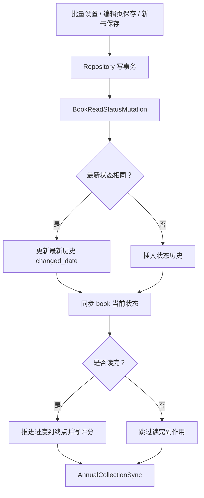

# 首页书架管理设计文档

更新日期：2026-06-07

## 设计原则

- 业务意图对齐 Android，平台表达遵循 iOS：数据写入严格一致，交互反馈使用 iOS 原生模式。
- 写入副作用收敛到 Data 层，页面层只表达用户意图和状态。
- 未完成跨模块能力不以占位入口上线，避免用户点击后只得到“迁移后开放”。

## 架构拆分

| 层级 | 设计 | 关键类型 |
| --- | --- | --- |
| Domain | 保留书架展示模型、批量输入、搜索来源与设置模型；新增结构化写操作反馈。 | `BookshelfBookListItem`、`BookshelfBatchReadStatusInput`、`BookshelfActionFeedback`、`BookSearchSettings` |
| Data | 抽出内部写入 helper，只接收 GRDB `Database`，供书架仓储和编辑仓储共用。 | `BookReadStatusMutation`、`AnnualCollectionSync`、`BookRepository`、`BookEditorRepository` |
| Service | 搜索服务接收页数配置，按来源执行多页请求、空页提前停止、稳定 ID 去重。 | `BookRemoteSearchService` |
| ViewModel | 触发 Repository 写入，维护 busy/error/success 反馈，不直接访问数据库。 | `BookViewModel`、`BookshelfBookListViewModel`、`BookSearchViewModel` |
| View | 网格接收排序辅助文案并参与无障碍；设置页只展示有效页数配置；菜单隐藏未完成入口；首页二级页切换由统一壳层硬切。 | `HomeSubtabScaffold`、`TopSwitcher`、`KeepAliveSwitcherHost`、`BookGridView`、`BookGridItemView`、`BookshelfDefaultCollectionView`、`BookshelfAggregateCollectionView`、`BookshelfBookListView`、`BookSearchSettingsPlaceholderView` |

## 阅读状态写入流程

### 关键规则

- `BookReadStatusMutation.updateBookReadStatus` 是状态变更唯一写入入口。
- 新书保存使用 `insertInitialReadStatusAndSyncAnnual`，只插入初始状态和年度同步，不额外强推读完进度，保持 Android `addBook` 语义。
- 编辑页先保存普通字段、分组和标签，再在状态确实变化时调用共享 helper。
- 批量读完评分允许 0；保存前统一 clamp 到 `0...50`。

## 年度书单同步

`AnnualCollectionSync` 在状态历史变化后重算指定书籍的年度归属：

- 读完年份来自 `book_read_status_record` 中 `read_status_id=3`、`changed_date>0`、`is_deleted=0` 的历史。
- 再追加 `book` 表当前读完状态快照，兼容历史表缺失但当前状态已读完的旧数据。
- 对已关联但不再属于读完年份的年度书单关系软删 `collection_book.is_deleted = 1`。
- 对缺失年份创建年度 `collection`，再插入或恢复 `collection_book` 关系。

## 新书排序

`BookEditorRepository` 读取 `UserDefaults` 的 `newAddBookPosition`：

- `0`：目标作用域 `MIN(book_order)-1`，默认值。
- `1`：目标作用域 `MAX(book_order)+1`。
- 目标作用域根据是否选择分组决定；默认书架和分组内顺序分别计算。

## 搜索来源与页数

- `BookSearchSource.productionCases` 是生产入口唯一来源，不遍历 `allCases`。
- 番茄保留内部解析能力，避免旧数据或调试路径丢失，但不在生产 chip 和选择器中默认出现。
- `BookSearchSettings.pageCounts` 只保留服务层消费页数的来源。
- `BookRemoteSearchService` 对豆瓣、起点、长佩执行分页；如果某页没有结果则提前停止，最后按稳定 ID 去重。

## 网格排序辅助信息

`BookshelfBookListItem.sortAuxiliaryText(for:)` 统一生成辅助文案，由默认书架和二级列表网格传入 `BookGridItemView`：

- 出版时间、阅读时长、读完时间、阅读进度、创建时间、修改时间、评分排序显示一行信息。
- 文案使用 `BookshelfTypography.gridSubtitle`，维持网格稳定高度。
- 辅助信息合入 accessibility label，VoiceOver 能读出当前排序上下文。

## 二级页硬切动效边界

本轮书籍/书单切换问题的真实 owner 不在单一父容器，而分布在顶部 selection、保活宿主与 UIKit collection host：

- `HomeSubtabScaffold` 是首页二级页默认壳层，`selectionTransactionPolicy` 默认 `.hardSwitch`；未来页面如果需要动画，必须显式传 `.animated(...)`。
- `TopSwitcherSelectionTransactionPolicy.hardSwitch` 同时禁用路由 selection 与顶部 `visualSelection` 的动画写入，避免顶部文字晚于内容页落位。
- `KeepAliveSwitcherHost` 对 selection、activated tabs 和首次激活新 tab 使用禁动画 transaction，已激活子页通过 `opacity/zIndex/allowsHitTesting/accessibilityHidden` 硬切，不产生 crossfade。
- `BookGridView` 将当前二级页可见状态传入默认书架与聚合集合区；SwiftUI 父级 transaction 不再被当作 UIKit 动画的唯一控制点。
- `BookshelfDefaultCollectionView` 与 `BookshelfAggregateCollectionView` 在 `updateUIView` 中使用 `configuration.allowsUpdateAnimation`，当 `isPageActive` 变化时取消可见 cell 动画并禁用本次结构动画，避免切回书籍页时卡片补帧进场。
- 搜索 drawer、整理模式、批量工具栏等业务动画仍保留在书籍页内部 motion 边界内，不由 `书籍` / `书单` 子页切换触发。

## 反馈交互

- `BookshelfActionFeedback.processing` 在写操作发起时立即显示，并由 `activeWriteAction` 禁用重复触发。
- `success` 保留 1.6 秒后自动清除。
- `warning` 和 `error` 不自动清除，直到下一次操作覆盖。
- 删除、重命名等中心确认继续用 `XMSystemAlert`，不新增 SwiftUI `.alert`。
- 不复刻 Android Toast；Toast 只用于理解“操作结果需要被感知”的业务意图。

## 后续边界

- 书单、导出、阅读详情、阅读计时、阅读记录、章节目录和补录阅读需要在对应模块真实落地后恢复入口。
- 若后续恢复长按菜单配置能力，iOS 应优先做菜单可见项设置与真实路由绑定，不能恢复只有提示的占位项。
